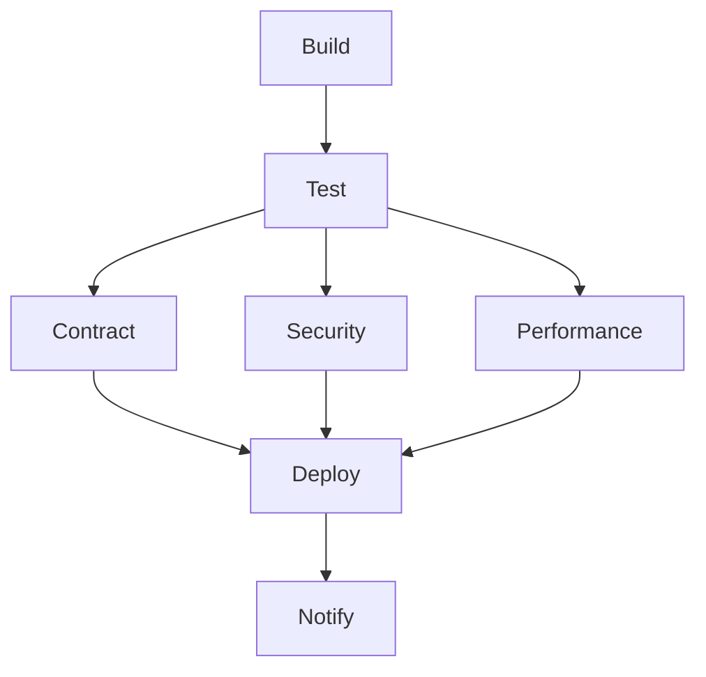

# 📘 01. Pipelines y Stages

- **Concepto Clave Asimilado:** Un pipeline de CI/CD es una serie automatizada de etapas (stages) que transforman código fuente en un despliegue en producción, pasando por build, test, seguridad y entrega.

---

### 🧪 PARTE A: Laboratorio Express (Mini-Proyecto Aislado)

- **Desafío:** Pipeline Hola Mundo — Crear un workflow de GitHub Actions con 3 stages secuenciales (build, test, deploy) donde cada uno imprime un mensaje.

**Instrucciones:**

1. Crear el archivo `.github/workflows/hola-mundo.yml` en tu repositorio.

```yaml
name: Hola Mundo Pipeline
on: [push]

jobs:
  pipeline:
    runs-on: ubuntu-latest
    steps:
      - uses: actions/checkout@v4

      - name: Stage 1 — Build
        run: echo "🛠️ BUILD: Compilando artefactos..."

      - name: Stage 2 — Test
        run: echo "🧪 TEST: Ejecutando suite de pruebas..."

      - name: Stage 3 — Deploy
        run: echo "🚀 DEPLOY: Desplegando a producción..."
```

2. Haz commit y push. Ve a la pestaña **Actions** de tu repositorio.
3. Observa cómo cada `echo` aparece como un paso secuencial en la ejecución.

**Salida esperada:**
```
🛠️ BUILD: Compilando artefactos...
🧪 TEST: Ejecutando suite de pruebas...
🚀 DEPLOY: Desplegando a producción...
```

---

### 🏗️ PARTE B: Evolución del Proyecto Principal de la Materia

- **Evolución del Software:** Stages del Pipeline Logístico — Definir los 7 stages del pipeline profesional para la API de Logística.

**Instrucciones:**

1. Crear `.github/workflows/pipeline-logistico.yml` con la estructura completa de stages:

```yaml
name: Pipeline Logístico
on:
  push:
    branches: [main, develop]
  pull_request:
    branches: [main]

jobs:
  build:
    name: 🔨 Build
    runs-on: ubuntu-latest
    steps:
      - uses: actions/checkout@v4
      - name: Set up JDK 17
        uses: actions/setup-java@v4
        with:
          java-version: '17'
          distribution: 'temurin'
      - name: Compilar
        run: mvn clean compile
      - name: Cache Maven
        uses: actions/cache@v4
        with:
          path: ~/.m2
          key: maven-${{ hashFiles('**/pom.xml') }}

  test:
    name: 🧪 Test
    needs: build
    runs-on: ubuntu-latest
    steps:
      - uses: actions/checkout@v4
      - name: Set up JDK 17
        uses: actions/setup-java@v4
        with:
          java-version: '17'
          distribution: 'temurin'
      - name: Ejecutar tests
        run: mvn test
      - name: Generar reporte Allure
        run: mvn allure:report

  contract:
    name: 🤝 Contract
    needs: test
    runs-on: ubuntu-latest
    steps:
      - uses: actions/checkout@v4
      - name: Set up JDK 17
        uses: actions/setup-java@v4
        with:
          java-version: '17'
          distribution: 'temurin'
      - name: Publicar contratos
        run: mvn pact:publish
        env:
          PACT_BROKER_URL: ${{ secrets.PACT_BROKER_URL }}
          PACT_BROKER_TOKEN: ${{ secrets.PACT_BROKER_TOKEN }}

  security:
    name: 🔒 Security
    needs: test
    runs-on: ubuntu-latest
    steps:
      - uses: actions/checkout@v4
      - name: Snyk Scan
        uses: snyk/actions/maven@master
        env:
          SNYK_TOKEN: ${{ secrets.SNYK_TOKEN }}
        with:
          args: --severity-threshold=high

  performance:
    name: ⚡ Performance
    needs: test
    runs-on: ubuntu-latest
    steps:
      - uses: actions/checkout@v4
      - name: Instalar k6
        run: |
          curl -s https://dl.k6.io/key.gpg | sudo apt-key add -
          sudo apt-add-repository "deb https://dl.k6.io/deb stable main"
          sudo apt-get update
          sudo apt-get install k6
      - name: Smoke test
        run: k6 run k6/smoke.js
      - name: Stress test
        run: k6 run k6/stress.js

  deploy:
    name: 🚀 Deploy
    needs: [contract, security, performance]
    runs-on: ubuntu-latest
    environment: production
    steps:
      - uses: actions/checkout@v4
      - name: Deploy a producción
        run: echo "Desplegando API logística..."
      - name: Healthcheck
        run: |
          sleep 10
          curl -f http://api-logistica.example.com/health

  notify:
    name: 📢 Notify
    needs: [deploy]
    if: always()
    runs-on: ubuntu-latest
    steps:
      - name: Notificar a Slack
        uses: slackapi/slack-github-action@v2
        with:
          webhook: ${{ secrets.SLACK_WEBHOOK }}
          webhook-type: incoming-webhook
          payload: |
            {
              "text": "Pipeline finalizado con estado: ${{ job.status }}"
            }
```

2. Haz commit del archivo y verifica que el pipeline se ejecute en GitHub Actions.
3. Observa el grafo de dependencias: `build → test → [contract, security, performance] → deploy → notify`.

**Diagrama de dependencias:**


**Conceptos clave:**
- `needs:` define la dependencia entre jobs
- `if: always()` asegura que notify corra incluso si falla
- `environment:` vincula el stage a un entorno con reglas de approval
- Los stages en paralelo (contract, security, performance) ahorran tiempo

---

**✅ Criterio de éxito:** El pipeline se ejecuta completo, mostrando los 7 stages en la interfaz de GitHub Actions con sus dependencias correctas.
