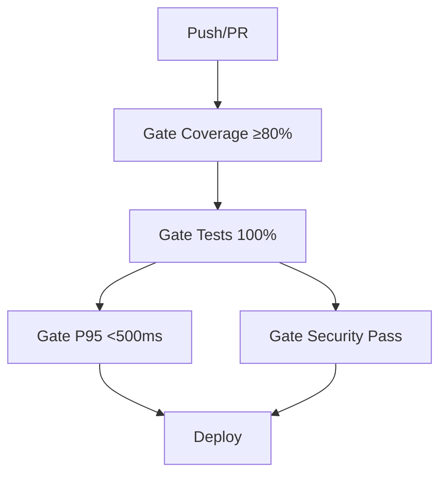

# 📘 03. Quality Gates

- **Concepto Clave Asimilado:** Un quality gate es una barrera automatizada que evalúa métricas de calidad y bloquea el avance del pipeline si no se cumplen los umbrales definidos.

---

### 🧪 PARTE A: Laboratorio Express (Mini-Proyecto Aislado)

- **Desafío:** Gate Simulado — Job que evalúa una condición matemática y falla deliberadamente si no se cumple.

**Instrucciones:**

1. Crear `.github/workflows/gate-simulado.yml`:

```yaml
name: Gate Simulado
on: [push]

jobs:
  evaluar-gate:
    runs-on: ubuntu-latest
    steps:
      - uses: actions/checkout@v4

      - name: Gate 1+1=2
        run: |
          RESULTADO=$((1 + 1))
          echo "Esperado: 2, Obtenido: $RESULTADO"
          if [ "$RESULTADO" -ne 2 ]; then
            echo "❌ GATE FALLÓ: 1+1 no es 2"
            exit 1
          fi
          echo "✅ GATE PASÓ: 1+1=2"

      - name: Gate de cadena no vacía
        run: |
          MENSAJE="Hola CI/CD"
          if [ -z "$MENSAJE" ]; then
            echo "❌ GATE FALLÓ: mensaje vacío"
            exit 1
          fi
          echo "✅ GATE PASÓ: mensaje = $MENSAJE"

      - name: Gate de porcentaje
        run: |
          COVERAGE=85
          MINIMO=80
          echo "Coverage: $COVERAGE% | Mínimo: $MINIMO%"
          if [ "$COVERAGE" -lt "$MINIMO" ]; then
            echo "❌ GATE FALLÓ: coverage por debajo del mínimo"
            exit 1
          fi
          echo "✅ GATE PASÓ: coverage cumple el umbral"
```

2. Haz push y verifica que los 3 gates se cumplan.
3. Modifica `COVERAGE=70` para ver el fallo.

---

### 🏗️ PARTE B: Evolución del Proyecto Principal de la Materia

- **Evolución del Software:** Gates del Pipeline Logístico — Implementar 4 quality gates que bloquean el deploy si no se cumplen.

**Instrucciones:**

1. Crear `.github/workflows/quality-gates.yml`:

```yaml
name: Quality Gates
on:
  push:
    branches: [main]
  pull_request:
    branches: [main]

jobs:
  gate-coverage:
    name: 📊 Gate — Cobertura ≥ 80%
    runs-on: ubuntu-latest
    outputs:
      coverage_passed: ${{ steps.check.outputs.passed }}
    steps:
      - uses: actions/checkout@v4
      - uses: actions/setup-java@v4
        with:
          java-version: '17'
          distribution: 'temurin'
      - run: mvn test jacoco:report
      - name: Extraer cobertura
        id: coverage
        run: |
          COVERAGE=$(grep -oP 'total.*?instruction.*?covered="\K[0-9.]+' target/site/jacoco/jacoco.xml | head -1)
          echo "coverage=$COVERAGE" >> $GITHUB_OUTPUT
      - name: Evaluar gate
        id: check
        run: |
          COVERAGE=${{ steps.coverage.outputs.coverage }}
          echo "Cobertura: $COVERAGE%"
          python -c "
          cov = float('$COVERAGE')
          if cov < 80.0:
              print(f'❌ GATE FALLÓ: cobertura {cov}% < 80%')
              exit(1)
          print(f'✅ GATE PASÓ: cobertura {cov}% >= 80%')
          "

  gate-tests:
    name: 🧪 Gate — Tests 100% pasando
    runs-on: ubuntu-latest
    needs: gate-coverage
    steps:
      - uses: actions/checkout@v4
      - uses: actions/setup-java@v4
        with:
          java-version: '17'
          distribution: 'temurin'
      - name: Ejecutar tests con fail-fast
        run: mvn test -Dmaven.test.failure.ignore=false
      - name: Verificar resultados
        run: |
          if [ -f target/surefire-reports/*.txt ] && grep -q "FAILURE" target/surefire-reports/*.txt 2>/dev/null; then
            echo "❌ GATE FALLÓ: existen tests fallidos"
            exit 1
          fi
          echo "✅ GATE PASÓ: todos los tests pasaron"

  gate-performance:
    name: ⚡ Gate — P95 < 500ms
    runs-on: ubuntu-latest
    needs: gate-tests
    steps:
      - uses: actions/checkout@v4
      - name: Instalar k6
        run: |
          curl -s https://dl.k6.io/key.gpg | sudo apt-key add -
          sudo apt-add-repository "deb https://dl.k6.io/deb stable main"
          sudo apt-get update
          sudo apt-get install k6
      - name: Ejecutar test de rendimiento
        run: k6 run k6/gate-check.js
      - name: Validar umbral
        run: |
          if [ -f k6-output.json ]; then
            P95=$(jq '.metrics.http_req_duration.p(95)' k6-output.json)
            echo "P95 = ${P95}ms"
            python -c "
            p95 = float($P95)
            if p95 >= 500:
                print(f'❌ GATE FALLÓ: P95 {p95}ms >= 500ms')
                exit(1)
            print(f'✅ GATE PASÓ: P95 {p95}ms < 500ms')
            "
          fi

  gate-security:
    name: 🔒 Gate — Security Scan Pass
    runs-on: ubuntu-latest
    needs: gate-tests
    steps:
      - uses: actions/checkout@v4
      - name: Snyk test
        uses: snyk/actions/maven@master
        continue-on-error: true
        id: snyk
        env:
          SNYK_TOKEN: ${{ secrets.SNYK_TOKEN }}
        with:
          args: --severity-threshold=high --json > snyk-report.json
      - name: Evaluar gate de seguridad
        run: |
          if [ -f snyk-report.json ]; then
            VULNS=$(jq '.vulnerabilities | length' snyk-report.json)
            echo "Vulnerabilidades encontradas: $VULNS"
            if [ "$VULNS" -gt 0 ]; then
              echo "❌ GATE FALLÓ: $VULNS vulnerabilidades críticas/altas"
              exit 1
            fi
          fi
          echo "✅ GATE PASÓ: sin vulnerabilidades de alta gravedad"
```

2. Crear `k6/gate-check.js`:

```javascript
import http from 'k6/http';
import { check } from 'k6';
import { textSummary } from 'https://jslib.k6.io/k6-summary/0.0.1/index.js';

export const options = {
  vus: 10,
  duration: '10s',
  thresholds: {
    http_req_duration: ['p(95)<500'],
  },
};

export default function () {
  const res = http.get('http://localhost:8080/health');
  check(res, { 'status 200': (r) => r.status === 200 });
}

export function handleSummary(data) {
  return { 'k6-output.json': JSON.stringify(data) };
}
```

**Arquitectura de Gates:**


**Conceptos clave:**
- `outputs:` permite pasar datos entre jobs
- `python -c` es útil para evaluaciones numéricas complejas
- `continue-on-error` permite inspeccionar el resultado sin abortar
- Los thresholds de k6 son el mecanismo nativo para gates de rendimiento

---

**✅ Criterio de éxito:** Los 4 quality gates se ejecutan secuencialmente y bloquean el pipeline si algún umbral no se cumple.
