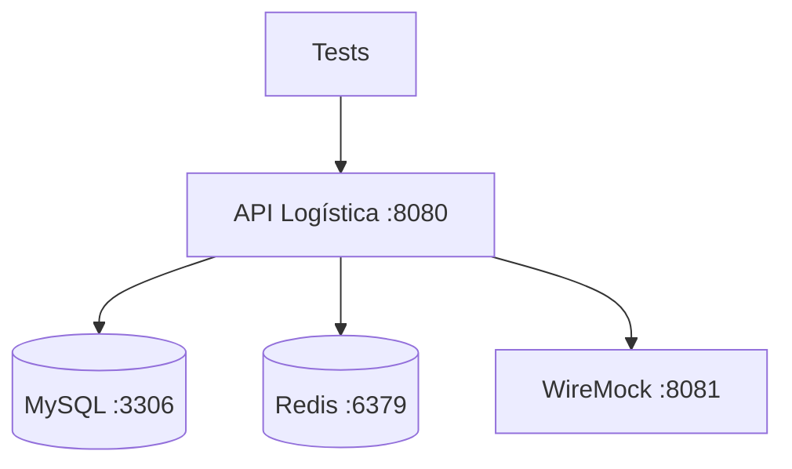

# 📘 05. Docker Compose Tests

- **Concepto Clave Asimilado:** Docker Compose orquesta múltiples contenedores para crear entornos de integración completos y reproducibles.

---

### 🧪 PARTE A: Laboratorio Express (Mini-Proyecto Aislado)

- **Desafío:** Docker Compose Mínimo — Servicio API que responde en el puerto 3000 + base de datos Postgres, levantar con `docker compose up`.

**Instrucciones:**

1. Crear `docker-compose.yml`:

```yaml
version: '3.9'

services:
  api:
    image: nginx:alpine
    ports:
      - "3000:80"
    environment:
      - DB_HOST=db
      - DB_PORT=5432
    depends_on:
      db:
        condition: service_healthy
    networks:
      - app-network

  db:
    image: postgres:16-alpine
    environment:
      POSTGRES_DB: testdb
      POSTGRES_USER: testuser
      POSTGRES_PASSWORD: testpass
    ports:
      - "5432:5432"
    healthcheck:
      test: ["CMD-SHELL", "pg_isready -U testuser -d testdb"]
      interval: 5s
      timeout: 5s
      retries: 5
    volumes:
      - pg-data:/var/lib/postgresql/data
    networks:
      - app-network

volumes:
  pg-data:

networks:
  app-network:
    driver: bridge
```

2. Ejecutar:

```bash
# Levantar servicios
docker compose up -d

# Verificar
docker compose ps
curl http://localhost:3000

# Logs
docker compose logs -f

# Limpiar
docker compose down -v
```

**Salida esperada:**
```
NAME                    IMAGE               STATUS
compose-api-1           nginx:alpine        Up 30 seconds
compose-db-1            postgres:16-alpine  Up 30 seconds (healthy)
```

---

### 🏗️ PARTE B: Evolución del Proyecto Principal de la Materia

- **Evolución del Software:** Compose de Logística — api + mysql + wiremock + redis interconectados para tests de integración.

**Instrucciones:**

1. Crear `docker-compose.test.yml`:

```yaml
version: '3.9'

name: logistica-test

services:
  # ============================================================
  # API de Logística (construida desde Dockerfile)
  # ============================================================
  api:
    build:
      context: .
      dockerfile: Dockerfile
    ports:
      - "8080:8080"
    environment:
      SPRING_PROFILES_ACTIVE: test
      DB_HOST: mysql
      DB_PORT: 3306
      DB_NAME: logistica_test
      DB_USER: logistica
      DB_PASS: logistica123
      REDIS_HOST: redis
      REDIS_PORT: 6379
      WIREMOCK_HOST: wiremock
      WIREMOCK_PORT: 8081
      LOG_LEVEL: DEBUG
    depends_on:
      mysql:
        condition: service_healthy
      redis:
        condition: service_started
      wiremock:
        condition: service_started
    healthcheck:
      test: ["CMD", "wget", "-qO-", "http://localhost:8080/health"]
      interval: 10s
      timeout: 5s
      retries: 10
      start_period: 40s
    networks:
      - logistica-net

  # ============================================================
  # MySQL para datos de logística
  # ============================================================
  mysql:
    image: mysql:8.0
    ports:
      - "3307:3306"
    environment:
      MYSQL_ROOT_PASSWORD: root123
      MYSQL_DATABASE: logistica_test
      MYSQL_USER: logistica
      MYSQL_PASSWORD: logistica123
    volumes:
      - mysql-data:/var/lib/mysql
      - ./sql/init.sql:/docker-entrypoint-initdb.d/init.sql
    healthcheck:
      test: ["CMD", "mysqladmin", "ping", "-h", "localhost"]
      interval: 5s
      timeout: 5s
      retries: 10
    networks:
      - logistica-net
    command: >
      --character-set-server=utf8mb4
      --collation-server=utf8mb4_unicode_ci
      --default-authentication-plugin=mysql_native_password

  # ============================================================
  # Redis para caché de tracking
  # ============================================================
  redis:
    image: redis:7-alpine
    ports:
      - "6380:6379"
    healthcheck:
      test: ["CMD", "redis-cli", "ping"]
      interval: 5s
      timeout: 3s
      retries: 5
    volumes:
      - redis-data:/data
    networks:
      - logistica-net

  # ============================================================
  # WireMock para simular servicios externos
  # ============================================================
  wiremock:
    image: wiremock/wiremock:3.5
    ports:
      - "8081:8081"
    volumes:
      - ./wiremock/mappings:/home/wiremock/mappings
      - ./wiremock/__files:/home/wiremock/__files
    command: >
      --port 8081
      --verbose
      --global-response-templating
    networks:
      - logistica-net

volumes:
  mysql-data:
  redis-data:

networks:
  logistica-net:
    driver: bridge
```

2. Crear `sql/init.sql`:

```sql
CREATE TABLE IF NOT EXISTS envios (
  id BIGINT AUTO_INCREMENT PRIMARY KEY,
  codigo VARCHAR(50) NOT NULL UNIQUE,
  destino VARCHAR(255) NOT NULL,
  estado ENUM('PENDIENTE', 'EN_TRANSITO', 'ENTREGADO', 'CANCELADO') DEFAULT 'PENDIENTE',
  fecha_creacion TIMESTAMP DEFAULT CURRENT_TIMESTAMP,
  fecha_actualizacion TIMESTAMP DEFAULT CURRENT_TIMESTAMP ON UPDATE CURRENT_TIMESTAMP
);

CREATE TABLE IF NOT EXISTS tracking (
  id BIGINT AUTO_INCREMENT PRIMARY KEY,
  envio_id BIGINT NOT NULL,
  ubicacion VARCHAR(255),
  evento VARCHAR(100),
  timestamp TIMESTAMP DEFAULT CURRENT_TIMESTAMP,
  FOREIGN KEY (envio_id) REFERENCES envios(id)
);

INSERT INTO envios (codigo, destino, estado) VALUES
  ('ENV-001', 'Ciudad de México', 'PENDIENTE'),
  ('ENV-002', 'Monterrey', 'EN_TRANSITO'),
  ('ENV-003', 'Guadalajara', 'ENTREGADO');
```

3. Crear wiremock stub `wiremock/mappings/servicio-externo.json`:

```json
{
  "request": {
    "method": "GET",
    "urlPath": "/api/externo/validar"
  },
  "response": {
    "status": 200,
    "jsonBody": {
      "valido": true,
      "codigo": "EXTERNO-OK"
    },
    "headers": {
      "Content-Type": "application/json"
    }
  }
}
```

4. Script de test `test-integracion.sh`:

```bash
#!/bin/bash
set -e

echo "🧪 Iniciando entorno de integración..."
docker compose -f docker-compose.test.yml up -d

echo "⏳ Esperando que la API esté saludable..."
until curl -s http://localhost:8080/health | grep '"status":"UP"'; do
  sleep 5
done

echo "✅ API saludable. Ejecutando tests..."
curl -s http://localhost:8080/api/envios | jq .
curl -s http://localhost:8080/api/envios/ENV-001 | jq .

echo "🧪 Tests de integración completados."
docker compose -f docker-compose.test.yml down -v
```

5. Ejecutar en CI:

```yaml
# Fragmento del workflow para tests de integración
test-integracion:
  name: 🔗 Integration Tests
  runs-on: ubuntu-latest
  steps:
    - uses: actions/checkout@v4
    - name: Setup Docker Compose
      run: docker compose -f docker-compose.test.yml up -d --build
    - name: Esperar servicios
      run: |
        sleep 30
        npx wait-on http://localhost:8080/health
    - name: Ejecutar tests de integración
      run: mvn verify -Pintegration-test
    - name: Limpiar
      if: always()
      run: docker compose -f docker-compose.test.yml down -v
```

**Arquitectura del entorno:**


**Conceptos clave:**
- `depends_on` con `condition: service_healthy` garantiza orden de inicio
- Volúmenes nombrados persisten datos entre reinicios
- WireMock permite simular APIs externas sin depender de ellas
- Perfil `test` de Spring activa configuraciones específicas para integración
- `docker compose down -v` limpia volúmenes para estado fresco

---

**✅ Criterio de éxito:** `docker compose up -d` levanta los 4 servicios, la API responde health OK, y los tests de integración pasan contra el entorno completo.
