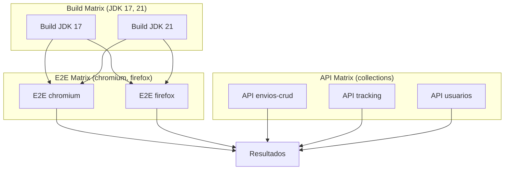

# 📘 06. Matrix Builds

- **Concepto Clave Asimilado:** Matrix builds ejecutan un mismo job en múltiples combinaciones de parámetros (OS, versiones de lenguaje, navegadores) en paralelo.

---

### 🧪 PARTE A: Laboratorio Express (Mini-Proyecto Aislado)

- **Desafío:** Matrix Hola Mundo — Matrix de sistemas operativos [ubuntu, windows] y versiones de Node [18, 20].

**Instrucciones:**

1. Crear `.github/workflows/matrix-hello.yml`:

```yaml
name: Matrix Hola Mundo
on: [push]

jobs:
  test-matrix:
    strategy:
      matrix:
        os: [ubuntu-latest, windows-latest]
        node: [18, 20]
      fail-fast: false

    runs-on: ${{ matrix.os }}
    name: Node ${{ matrix.node }} on ${{ matrix.os }}

    steps:
      - uses: actions/checkout@v4
      - uses: actions/setup-node@v4
        with:
          node-version: ${{ matrix.node }}
      - name: Verificar versión
        run: |
          echo "OS: ${{ matrix.os }}"
          echo "Node: $(node --version)"
          echo "NPM: $(npm --version)"
      - name: Test simple
        run: node -e "console.log('✅ OK en ${{ matrix.os }} con Node ${{ matrix.node }}')"
```

2. Haz push y observa cómo se crean 4 jobs paralelos (2 OS × 2 Node).

**Salida esperada — 4 jobs:**
```
✓ Node 18 on ubuntu-latest
✓ Node 20 on ubuntu-latest
✓ Node 18 on windows-latest
✓ Node 20 on windows-latest
```

---

### 🏗️ PARTE B: Evolución del Proyecto Principal de la Materia

- **Evolución del Software:** Matrix Logístico — Combinaciones de JDK [17, 21] + navegador [chromium, firefox] para suite E2E + API.

**Instrucciones:**

1. Crear `.github/workflows/matrix-logistica.yml`:

```yaml
name: Matrix Logístico
on:
  push:
    branches: [main]
  pull_request:
    branches: [main]

jobs:
  # ============================================================
  # Matrix de compilación con distintas JDK
  # ============================================================
  build-matrix:
    name: Build JDK ${{ matrix.jdk }}
    strategy:
      matrix:
        jdk: [17, 21]
      fail-fast: false
      max-parallel: 2

    runs-on: ubuntu-latest

    steps:
      - uses: actions/checkout@v4

      - name: Set up JDK ${{ matrix.jdk }}
        uses: actions/setup-java@v4
        with:
          java-version: ${{ matrix.jdk }}
          distribution: 'temurin'
          cache: maven

      - name: Compilar con JDK ${{ matrix.jdk }}
        run: mvn clean compile -B

      - name: Ejecutar tests unitarios
        run: mvn test -B

      - name: Empaquetar
        run: mvn package -DskipTests -B

      - name: Subir artefacto JDK${{ matrix.jdk }}
        uses: actions/upload-artifact@v4
        with:
          name: api-jdk${{ matrix.jdk }}
          path: target/*.jar

  # ============================================================
  # Matrix de tests E2E con distintos navegadores
  # ============================================================
  e2e-matrix:
    name: E2E ${{ matrix.browser }}
    needs: build-matrix
    strategy:
      matrix:
        browser: [chromium, firefox]
      fail-fast: true

    runs-on: ubuntu-latest

    steps:
      - uses: actions/checkout@v4

      - uses: actions/setup-node@v4
        with:
          node-version: '20'
          cache: 'npm'

      - run: npm ci

      - name: Desplegar entorno de prueba
        run: docker compose -f docker-compose.test.yml up -d --build

      - name: Esperar servicios
        run: |
          npx wait-on http://localhost:8080/health
          npx wait-on tcp:3307

      - name: Ejecutar E2E con ${{ matrix.browser }}
        run: npx playwright test --project=${{ matrix.browser }}
        env:
          BROWSER: ${{ matrix.browser }}
          BASE_URL: http://localhost:8080

      - name: Subir reporte E2E-${{ matrix.browser }}
        if: always()
        uses: actions/upload-artifact@v4
        with:
          name: playwright-report-${{ matrix.browser }}
          path: playwright-report/

      - name: Limpiar
        if: always()
        run: docker compose -f docker-compose.test.yml down -v

  # ============================================================
  # Matrix de tests de API con Newman (Postman)
  # ============================================================
  api-tests-matrix:
    name: API Tests — ${{ matrix.collection }}
    needs: build-matrix
    strategy:
      matrix:
        collection:
          - envios-crud
          - tracking
          - usuarios

    runs-on: ubuntu-latest

    steps:
      - uses: actions/checkout@v4

      - name: Instalar Newman
        run: npm install -g newman

      - name: Ejecutar colección ${{ matrix.collection }}
        run: |
          newman run postman/${{ matrix.collection }}.postman_collection.json \
            -e postman/logistica.postman_environment.json \
            --reporters cli,junit \
            --reporter-junit-export reports/${{ matrix.collection }}.xml
        continue-on-error: true

      - name: Subir reporte ${{ matrix.collection }}
        if: always()
        uses: actions/upload-artifact@v4
        with:
          name: newman-report-${{ matrix.collection }}
          path: reports/${{ matrix.collection }}.xml

  # ============================================================
  # Consolidación — todos deben pasar
  # ============================================================
  resultados:
    name: 📋 Resultados Consolidados
    needs: [build-matrix, e2e-matrix, api-tests-matrix]
    if: always()
    runs-on: ubuntu-latest
    steps:
      - name: Verificar estado general
        run: |
          echo "Build matrix: ${{ needs.build-matrix.result }}"
          echo "E2E matrix: ${{ needs.e2e-matrix.result }}"
          echo "API matrix: ${{ needs.api-tests-matrix.result }}"
          if [ "${{ needs.build-matrix.result }}" != "success" ] || \
             [ "${{ needs.e2e-matrix.result }}" != "success" ] || \
             [ "${{ needs.api-tests-matrix.result }}" != "success" ]; then
            echo "❌ Algunos jobs de la matrix fallaron"
            exit 1
          fi
          echo "✅ Todos los jobs de la matrix pasaron"
```

**Estrategias de matrix:**

| Parámetro       | Valor                           | Propósito                         |
| --------------- | ------------------------------- | --------------------------------- |
| `fail-fast`     | `false` en build                | No cancelar otros JDK al fallar 1 |
| `fail-fast`     | `true` en E2E                   | Cancelar si un browser falla     |
| `max-parallel`  | `2`                             | Límite de jobs simultáneos       |
| `include`       | (opcional) Pares extra          | Añadir casos específicos         |
| `exclude`       | (opcional) Combinaciones a omitir | Eliminar pares no deseados      |

**Visualización de la matrix:**


**Conceptos clave:**
- `strategy.matrix` genera automáticamente N jobs del producto cartesiano
- `fail-fast: false` es crítico en matrices de compatibilidad
- Los artefactos deben nombrarse con variables de matrix para evitar colisiones
- `needs` permite sincronizar matrices paralelas en un job de consolidación
- Las matrices se pueden combinar con `include`/`exclude` para casos extremos

---

**✅ Criterio de éxito:** Todos los jobs de la matrix se ejecutan en paralelo, los reportes se suben sin colisión de nombres, y el job de consolidación refleja el estado general.
