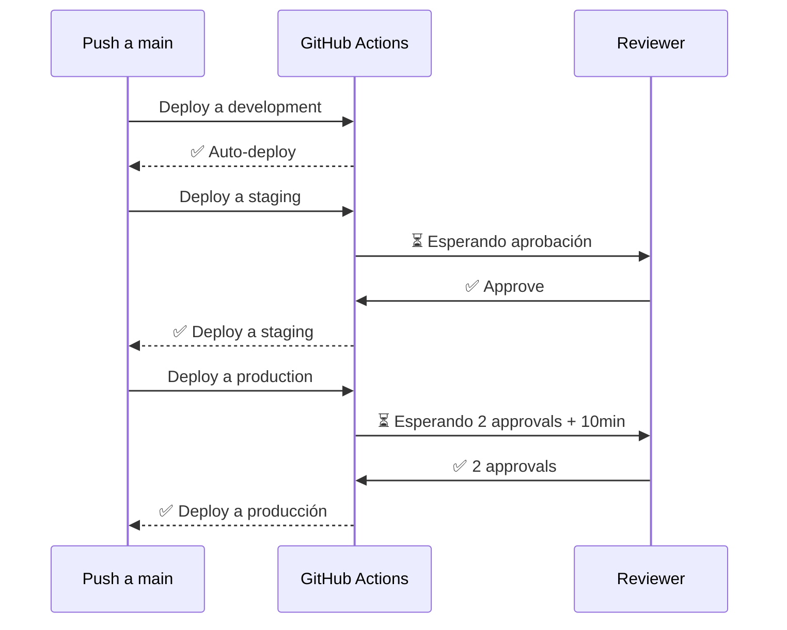

# 📘 07. Environments y Secrets

- **Concepto Clave Asimilado:** Los entornos (environments) de GitHub agrupan secretos cifrados y reglas de protección, permitiendo segmentar el acceso por etapa (dev, staging, prod).

---

### 🧪 PARTE A: Laboratorio Express (Mini-Proyecto Aislado)

- **Desafío:** Secrets Demo — Workflow que usa un secreto `MY_SECRET` y lo muestra en los logs con masking automático.

**Instrucciones:**

1. Configurar el secreto en GitHub:
   - Ir a Settings → Secrets and variables → Actions
   - Clic en **New repository secret**
   - Name: `MY_SECRET`
   - Value: `super-secreto-123`
   - Guardar

2. Crear `.github/workflows/secrets-demo.yml`:

```yaml
name: Secrets Demo
on: [push]

jobs:
  demo:
    runs-on: ubuntu-latest
    steps:
      - name: Usar secreto (masked automáticamente)
        run: |
          echo "El secreto es: ${{ secrets.MY_SECRET }}"
          echo "Longitud: ${{ env.MY_SECRET_LENGTH }}"
        env:
          MY_SECRET_LENGTH: ${{ length(secrets.MY_SECRET) }}

      - name: Pasar secreto a variable de entorno
        run: |
          echo "Usando el secreto desde variable de entorno..."
          # Esto imprime *** gracias al masking
          echo "API Key: ${API_KEY}"
        env:
          API_KEY: ${{ secrets.MY_SECRET }}

      - name: Verificar que no se filtró
        run: |
          echo "GitHub Actions enmascara automáticamente los valores de secrets"
          echo "En los logs verás *** en lugar del valor real"
```

3. Haz push y revisa los logs. Verás `***` donde aparece el secreto.

---

### 🏗️ PARTE B: Evolución del Proyecto Principal de la Materia

- **Evolución del Software:** Secrets del Pipeline — `API_KEY`, `DB_URL`, `SLACK_WEBHOOK`, `PACT_BROKER_TOKEN` configurados en GitHub Environments con protección.

**Instrucciones:**

1. Crear los entornos en GitHub:
   - Settings → Environments → **New environment**
   - Crear: `development`, `staging`, `production`

2. Configurar secrets por entorno:

| Secreto              | development       | staging           | production            |
| -------------------- | ----------------- | ----------------- | --------------------- |
| `API_KEY`            | dev-key-123       | stg-key-456       | prod-key-789          |
| `DB_URL`             | localhost:3306    | stg-db:3306       | prod-db.amazonaws.com |
| `SLACK_WEBHOOK`      | dev-hook          | stg-hook          | prod-hook             |
| `PACT_BROKER_TOKEN`  | dev-token         | stg-token         | prod-token            |
| `SNYK_TOKEN`         | (único global)    | (único global)    | (único global)        |
| `DOCKER_REGISTRY`    | docker.io/dev     | docker.io/stg     | docker.io/prod        |

3. Crear `.github/workflows/deploy-seguro.yml`:

```yaml
name: Deploy Seguro con Environments
on:
  push:
    branches: [main]

jobs:
  # ============================================================
  # Development — despliegue automático
  # ============================================================
  deploy-dev:
    name: 🚀 Deploy a Development
    runs-on: ubuntu-latest
    environment:
      name: development
      url: https://dev.logistica.example.com

    env:
      API_KEY: ${{ secrets.API_KEY }}
      DB_URL: ${{ secrets.DB_URL }}
      SLACK_WEBHOOK: ${{ secrets.SLACK_WEBHOOK }}

    steps:
      - uses: actions/checkout@v4
      - name: Validar secrets presentes
        run: |
          if [ -z "$API_KEY" ]; then echo "❌ API_KEY no configurada"; exit 1; fi
          if [ -z "$DB_URL" ]; then echo "❌ DB_URL no configurada"; exit 1; fi
          echo "✅ Todos los secrets están configurados"
      - name: Desplegar a dev
        run: |
          echo "Desplegando a development..."
          echo "DB: $DB_URL"
          echo "API_KEY: ${API_KEY:0:4}****"
      - name: Healthcheck
        run: |
          echo "Healthcheck dev: OK"

  # ============================================================
  # Staging — requiere aprobación manual
  # ============================================================
  deploy-staging:
    name: 🚀 Deploy a Staging
    needs: deploy-dev
    runs-on: ubuntu-latest
    environment:
      name: staging
      url: https://staging.logistica.example.com

    env:
      API_KEY: ${{ secrets.API_KEY }}
      DB_URL: ${{ secrets.DB_URL }}
      SLACK_WEBHOOK: ${{ secrets.SLACK_WEBHOOK }}
      PACT_BROKER_TOKEN: ${{ secrets.PACT_BROKER_TOKEN }}

    steps:
      - uses: actions/checkout@v4
      - name: Verificar contratos
        run: |
          echo "Verificando contratos contra Pact Broker..."
          # curl -H "Authorization: Bearer $PACT_BROKER_TOKEN" ...
          echo "✅ Contratos verificados"
      - name: Desplegar a staging
        run: |
          echo "Desplegando a staging..."
          echo "DB: $DB_URL"
      - name: Smoke test
        run: |
          curl -f https://staging.logistica.example.com/health
          echo "✅ Smoke test pasado"

  # ============================================================
  # Production — requiere aprobación + reviewers
  # ============================================================
  deploy-production:
    name: 🚀 Deploy a Production
    needs: deploy-staging
    runs-on: ubuntu-latest
    environment:
      name: production
      url: https://logistica.example.com

    env:
      API_KEY: ${{ secrets.API_KEY }}
      DB_URL: ${{ secrets.DB_URL }}
      SLACK_WEBHOOK: ${{ secrets.SLACK_WEBHOOK }}
      DOCKER_REGISTRY: ${{ secrets.DOCKER_REGISTRY }}

    steps:
      - uses: actions/checkout@v4
      - name: Desplegar a producción
        run: |
          echo "Desplegando a producción..."
          echo "Registry: $DOCKER_REGISTRY"
      - name: Healthcheck post-deploy
        run: |
          for i in {1..5}; do
            if curl -sf https://logistica.example.com/health > /dev/null; then
              echo "✅ Producción saludable"
              exit 0
            fi
            echo "Intento $i: no responde, esperando..."
            sleep 10
          done
          echo "❌ Producción no responde después de 5 intentos"
          exit 1
      - name: Notificar éxito
        run: |
          echo "✅ Despliegue a producción completado"

  # ============================================================
  # Job con secretos para múltiples entornos usando matrix
  # ============================================================
  deploy-matrix:
    name: 🚀 Deploy a ${{ matrix.env.name }}
    strategy:
      matrix:
        env:
          - name: development
            url: https://dev.logistica.example.com
            auto: true
          - name: staging
            url: https://staging.logistica.example.com
            auto: false
          - name: production
            url: https://logistica.example.com
            auto: false

    runs-on: ubuntu-latest
    environment:
      name: ${{ matrix.env.name }}
      url: ${{ matrix.env.url }}

    env:
      API_KEY: ${{ secrets.API_KEY }}
      DB_URL: ${{ secrets.DB_URL }}

    steps:
      - uses: actions/checkout@v4
      - name: Desplegar a ${{ matrix.env.name }}
        run: |
          echo "Desplegando a ${{ matrix.env.name }}..."
          echo "URL: ${{ matrix.env.url }}"
          echo "Auto deploy: ${{ matrix.env.auto }}"
      - name: Healthcheck
        run: echo "Healthcheck ${{ matrix.env.name }} OK"
```

**Configuración de protección de entornos:**

Para `production` (Settings → Environments → production):

| Regla                        | Valor                |
| ---------------------------- | -------------------- |
| Required reviewers           | 2 reviewers          |
| Wait timer                   | 10 minutos           |
| Deployment branches          | main                 |
| Prevent self-review          | ✅                   |

Para `staging`:

| Regla                        | Valor                |
| ---------------------------- | -------------------- |
| Required reviewers           | 1 reviewer           |
| Wait timer                   | 0 minutos            |
| Deployment branches          | main, develop        |

**Conceptos clave:**

| Concepto         | Propósito                                         |
| ---------------- | ------------------------------------------------- |
| `environment:`   | Vincula el job a un entorno con secrets propios   |
| `url:`           | Enlace directo desde la UI de Actions             |
| Required reviewers | Bloquea el deploy hasta aprobación manual        |
| Wait timer       | Periodo de enfriamiento antes del deploy          |
| Secrets por env  | Cada entorno tiene sus propias credenciales       |
| `env:` en job    | Variables de entorno disponibles en todos los steps|
| GitHub masking   | Oculta automáticamente valores de secrets en logs |

**Flujo de approvals:**


---

**✅ Criterio de éxito:** Los secrets se inyectan correctamente por entorno, development despliega automáticamente, staging requiere 1 approval, y producción requiere 2 approvals + wait timer. Los valores sensibles aparecen enmascarados en los logs.
