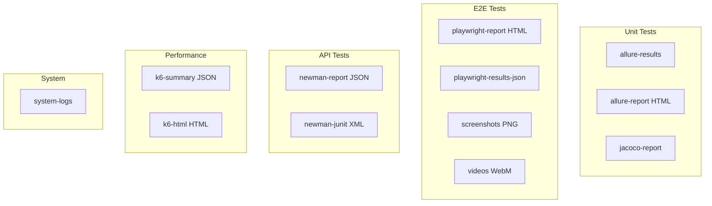

# 📘 08. Allure y Artefactos

- **Concepto Clave Asimilado:** Los artefactos de GitHub Actions preservan archivos generados durante el workflow (reportes, logs, binarios) y los ponen a disposición para descarga o uso en jobs posteriores.

---

### 🧪 PARTE A: Laboratorio Express (Mini-Proyecto Aislado)

- **Desafío:** Allure Artefacto — Workflow que corre tests Maven, genera el reporte Allure y lo sube como artefacto.

**Instrucciones:**

1. Crear `.github/workflows/allure-artefacto.yml`:

```yaml
name: Allure Artefacto
on: [push]

jobs:
  test-allure:
    runs-on: ubuntu-latest
    steps:
      - uses: actions/checkout@v4

      - name: Set up JDK 17
        uses: actions/setup-java@v4
        with:
          java-version: '17'
          distribution: 'temurin'
          cache: maven

      - name: Ejecutar tests con Allure
        run: mvn clean test allure:report

      - name: Verificar reporte generado
        run: |
          ls -la target/site/allure-maven-plugin/
          echo "Reporte generado correctamente"

      - name: Subir reporte Allure como artefacto
        uses: actions/upload-artifact@v4
        with:
          name: allure-report
          path: target/site/allure-maven-plugin/
          retention-days: 7
```

2. Haz push y verifica que el artefacto aparezca en la ejecución.
3. Descarga el artefacto y abre `index.html` en un navegador.

---

### 🏗️ PARTE B: Evolución del Proyecto Principal de la Materia

- **Evolución del Software:** Artefactos Completos — allure-results, playwright-report, newman-report, k6-json subidos y disponibles por 30 días.

**Instrucciones:**

1. Crear `.github/workflows/artefactos-completos.yml`:

```yaml
name: Artefactos del Pipeline Logístico
on:
  push:
    branches: [main]
  pull_request:
    branches: [main]

jobs:
  # ============================================================
  # Tests unitarios + Allure
  # ============================================================
  unit-tests:
    name: 🧪 Unit Tests + Allure
    runs-on: ubuntu-latest
    steps:
      - uses: actions/checkout@v4
      - uses: actions/setup-java@v4
        with:
          java-version: '17'
          distribution: 'temurin'
          cache: maven

      - run: mvn clean test

      - name: Generar reporte Allure
        run: mvn allure:report

      - name: Subir resultados Allure (raw)
        uses: actions/upload-artifact@v4
        with:
          name: allure-results
          path: target/allure-results/
          retention-days: 30

      - name: Subir reporte Allure (HTML)
        uses: actions/upload-artifact@v4
        with:
          name: allure-report
          path: target/site/allure-maven-plugin/
          retention-days: 30

      - name: Subir reporte JaCoCo
        uses: actions/upload-artifact@v4
        with:
          name: jacoco-report
          path: target/site/jacoco/
          retention-days: 30

  # ============================================================
  # Tests E2E con Playwright
  # ============================================================
  e2e-tests:
    name: 🎭 E2E Tests
    runs-on: ubuntu-latest
    steps:
      - uses: actions/checkout@v4
      - uses: actions/setup-node@v4
        with:
          node-version: '20'
          cache: 'npm'
      - run: npm ci

      - name: Levantar entorno
        run: docker compose -f docker-compose.test.yml up -d --build
      - name: Esperar API
        run: npx wait-on http://localhost:8080/health

      - name: Ejecutar Playwright
        run: npx playwright test --reporter=html,json
        continue-on-error: true

      - name: Subir reporte Playwright (HTML)
        uses: actions/upload-artifact@v4
        with:
          name: playwright-report
          path: playwright-report/
          retention-days: 30

      - name: Subir resultados JSON
        uses: actions/upload-artifact@v4
        with:
          name: playwright-results-json
          path: test-results.json
          retention-days: 30

      - name: Subir screenshots de fallos
        if: failure()
        uses: actions/upload-artifact@v4
        with:
          name: playwright-screenshots
          path: test-results/**/screenshot*.png
          retention-days: 30

      - name: Subir videos de pruebas
        if: always()
        uses: actions/upload-artifact@v4
        with:
          name: playwright-videos
          path: test-results/**/*.webm
          retention-days: 14

      - name: Limpiar
        if: always()
        run: docker compose -f docker-compose.test.yml down -v

  # ============================================================
  # Tests de API con Newman (Postman)
  # ============================================================
  api-tests:
    name: 📬 API Tests (Newman)
    runs-on: ubuntu-latest
    steps:
      - uses: actions/checkout@v4
      - name: Instalar Newman
        run: npm install -g newman

      - name: Ejecutar colecciones
        run: |
          newman run postman/envios-crud.postman_collection.json \
            -e postman/logistica.postman_environment.json \
            --reporters cli,json,junit \
            --reporter-json-export reports/newman-report.json \
            --reporter-junit-export reports/newman-junit.xml
        continue-on-error: true

      - name: Subir reporte Newman (JSON)
        uses: actions/upload-artifact@v4
        with:
          name: newman-report
          path: reports/newman-report.json
          retention-days: 30

      - name: Subir reporte Newman (JUnit)
        uses: actions/upload-artifact@v4
        with:
          name: newman-junit
          path: reports/newman-junit.xml
          retention-days: 30

  # ============================================================
  # Tests de rendimiento con k6
  # ============================================================
  performance-tests:
    name: ⚡ Performance Tests (k6)
    runs-on: ubuntu-latest
    steps:
      - uses: actions/checkout@v4

      - name: Instalar k6
        run: |
          curl -s https://dl.k6.io/key.gpg | sudo apt-key add -
          sudo apt-add-repository "deb https://dl.k6.io/deb stable main"
          sudo apt-get update
          sudo apt-get install k6

      - name: Smoke test
        run: k6 run k6/smoke.js --summary-export k6/smoke-summary.json
        continue-on-error: true

      - name: Stress test
        run: k6 run k6/stress.js --summary-export k6/stress-summary.json
        continue-on-error: true

      - name: Soak test
        run: k6 run k6/soak.js --summary-export k6/soak-summary.json
        continue-on-error: true

      - name: Subir resultados k6
        uses: actions/upload-artifact@v4
        with:
          name: k6-results
          path: k6/*-summary.json
          retention-days: 30

      - name: Subir HTML report si existe
        uses: actions/upload-artifact@v4
        with:
          name: k6-html-report
          path: k6/**/*.html
          retention-days: 30

  # ============================================================
  # Logs del sistema
  # ============================================================
  system-logs:
    name: 📋 System Logs
    runs-on: ubuntu-latest
    steps:
      - uses: actions/checkout@v4

      - name: Recopilar logs del sistema
        run: |
          mkdir -p logs/system
          dmesg > logs/system/dmesg.log 2>/dev/null || true
          df -h > logs/system/disk.log
          free -m > logs/system/memory.log
          ps aux > logs/system/processes.log
          docker images > logs/system/docker-images.log 2>/dev/null || true
          echo "Logs recopilados"

      - name: Subir logs del sistema
        uses: actions/upload-artifact@v4
        with:
          name: system-logs
          path: logs/system/
          retention-days: 7
```

**Resumen de artefactos generados:**



**Retention policy:**

| Artefacto            | Días | Motivo                     |
| -------------------- | ---- | -------------------------- |
| allure-results       | 30   | Análisis histórico         |
| allure-report        | 30   | Visualización              |
| playwright-report    | 30   | Debug de fallos            |
| playwright-screenshots| 30  | Evidencia visual           |
| playwright-videos    | 14   | Ocupan más espacio         |
| newman-report        | 30   | Trazabilidad de API        |
| k6-results           | 30   | Análisis de rendimiento    |
| system-logs          | 7    | Debug del runner           |

**Conceptos clave:**

| Concepto            | Propósito                                      |
| ------------------- | ---------------------------------------------- |
| `upload-artifact`   | Sube archivos al almacenamiento de GitHub      |
| `retention-days`    | Días que el artefacto estará disponible        |
| `continue-on-error` | No aborta el workflow si el test falla         |
| `if: failure()`     | Sube artefactos solo cuando hay fallo          |
| `if: always()`      | Sube artefactos incluso si el paso anterior falla |

---

**✅ Criterio de éxito:** Todos los reportes (Allure, Playwright, Newman, k6, logs) se suben como artefactos independientes con sus respectivos retention-days y son descargables desde la UI de GitHub Actions.
