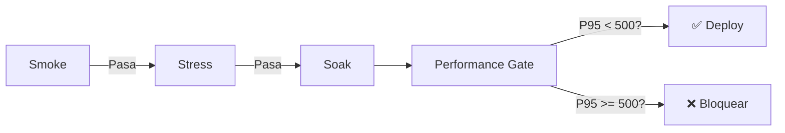

# 📘 09. k6 y Performance Gates

- **Concepto Clave Asimilado:** k6 es una herramienta de testing de rendimiento open-source que permite ejecutar pruebas de carga (smoke, stress, soak) desde CI/CD con thresholds que actúan como quality gates.

---

### 🧪 PARTE A: Laboratorio Express (Mini-Proyecto Aislado)

- **Desafío:** k6 en GHA — Workflow que instala k6, ejecuta un smoke.js y verifica thresholds.

**Instrucciones:**

1. Crear `k6/smoke.js`:

```javascript
import http from 'k6/http';
import { check, sleep } from 'k6';

export const options = {
  vus: 1,
  duration: '10s',
  thresholds: {
    http_req_duration: ['p(95)<500'],
    http_req_failed: ['rate<0.01'],
  },
};

export default function () {
  const res = http.get('https://test.k6.io');
  check(res, {
    'status es 200': (r) => r.status === 200,
    'respuesta < 500ms': (r) => r.timings.duration < 500,
  });
  sleep(1);
}
```

2. Crear `.github/workflows/k6-smoke.yml`:

```yaml
name: k6 Smoke Test
on: [push]

jobs:
  k6-smoke:
    runs-on: ubuntu-latest
    steps:
      - uses: actions/checkout@v4

      - name: Instalar k6
        run: |
          sudo apt-key adv --keyserver hkp://keyserver.ubuntu.com:80 \
            --recv-keys C5AD17C747E3415A3642D57D77C6C491D6AC1D69
          echo "deb https://dl.k6.io/deb stable main" | \
            sudo tee /etc/apt/sources.list.d/k6.list
          sudo apt-get update
          sudo apt-get install k6

      - name: Ejecutar smoke test
        run: k6 run k6/smoke.js
```

3. Haz push. El pipeline debe fallar si el threshold `p(95)<500` no se cumple.

---

### 🏗️ PARTE B: Evolución del Proyecto Principal de la Materia

- **Evolución del Software:** Performance Stage — Scripts smoke + stress + soak ejecutados en CI, con gate que bloquea si p95 > 500ms.

**Instrucciones:**

1. Crear `k6/smoke.js` — Prueba rápida de verificación:

```javascript
import http from 'k6/http';
import { check, sleep } from 'k6';

export const options = {
  vus: 1,
  duration: '30s',
  thresholds: {
    http_req_duration: ['p(95)<500'],
    http_req_failed: ['rate<0.01'],
  },
  summaryTrendStats: ['avg', 'min', 'med', 'max', 'p(95)', 'p(99)'],
};

const BASE_URL = __ENV.BASE_URL || 'http://localhost:8080';

export default function () {
  const endpoints = [
    `${BASE_URL}/health`,
    `${BASE_URL}/api/envios`,
    `${BASE_URL}/api/envios/ENV-001`,
  ];

  for (const url of endpoints) {
    const res = http.get(url);
    check(res, {
      [`${url} status 200`]: (r) => r.status === 200,
      [`${url} rápido`]: (r) => r.timings.duration < 500,
    });
    sleep(0.5);
  }
}
```

2. Crear `k6/stress.js` — Prueba de estrés progresivo:

```javascript
import http from 'k6/http';
import { check, sleep } from 'k6';

export const options = {
  stages: [
    { duration: '1m', target: 10 },   // Subida gradual
    { duration: '2m', target: 50 },   // Carga media
    { duration: '3m', target: 100 },  // Carga pico
    { duration: '1m', target: 0 },    // Bajada
  ],
  thresholds: {
    http_req_duration: ['p(95)<800', 'avg<400'],
    http_req_failed: ['rate<0.05'],
    http_reqs: ['rate>50'],
  },
};

const BASE_URL = __ENV.BASE_URL || 'http://localhost:8080';

export default function () {
  const payload = JSON.stringify({
    origen: 'CDMX',
    destino: 'MTY',
    peso: Math.random() * 100,
  });

  const params = {
    headers: { 'Content-Type': 'application/json' },
  };

  const res = http.post(`${BASE_URL}/api/envios`, payload, params);
  check(res, {
    'status 201': (r) => r.status === 201,
    'creación rápida': (r) => r.timings.duration < 1000,
  });

  sleep(0.2);
}
```

3. Crear `k6/soak.js` — Prueba de resistencia prolongada:

```javascript
import http from 'k6/http';
import { check, sleep } from 'k6';

export const options = {
  stages: [
    { duration: '2m', target: 20 },   // Calentamiento
    { duration: '10m', target: 20 },  // Carga constante (10 min)
    { duration: '2m', target: 0 },    // Bajada
  ],
  thresholds: {
    http_req_duration: ['p(95)<1000', 'avg<500'],
    http_req_failed: ['rate<0.01'],
   http_req_waiting: ['p(95)<800'],
  },
};

const BASE_URL = __ENV.BASE_URL || 'http://localhost:8080';

export default function () {
  const res = http.get(`${BASE_URL}/api/envios/ENV-001`);
  check(res, {
    'status 200': (r) => r.status === 200,
    'tracking presente': (r) => r.json('codigo') !== undefined,
  });

  sleep(3); // Simula usuario real
}
```

4. Crear `.github/workflows/performance-stage.yml`:

```yaml
name: Performance Stage
on:
  push:
    branches: [main]
  pull_request:
    branches: [main]
  schedule:
    - cron: '0 6 * * 1' # Lunes 6am

jobs:
  # ============================================================
  # Smoke test — verificación rápida
  # ============================================================
  smoke:
    name: 🔥 Smoke
    runs-on: ubuntu-latest
    steps:
      - uses: actions/checkout@v4

      - name: Set up JDK 17
        uses: actions/setup-java@v4
        with:
          java-version: '17'
          distribution: 'temurin'

      - name: Iniciar API local
        run: |
          mvn spring-boot:run -DskipTests &
          npx wait-on http://localhost:8080/health --timeout 60000

      - name: Instalar k6
        run: |
          sudo apt-key adv --keyserver hkp://keyserver.ubuntu.com:80 \
            --recv-keys C5AD17C747E3415A3642D57D77C6C491D6AC1D69
          echo "deb https://dl.k6.io/deb stable main" | \
            sudo tee /etc/apt/sources.list.d/k6.list
          sudo apt-get update
          sudo apt-get install k6

      - name: Smoke test
        run: |
          k6 run k6/smoke.js \
            --summary-export k6/smoke-summary.json \
            -e BASE_URL=http://localhost:8080

      - name: Validar threshold
        run: |
          P95=$(jq '.metrics.http_req_duration.p(95)' k6/smoke-summary.json)
          echo "P95 del smoke test: ${P95}ms"
          python -c "
          p95 = float($P95)
          if p95 >= 500:
              print(f'❌ GATE FALLÓ: P95={p95}ms >= 500ms')
              exit(1)
          print(f'✅ GATE PASÓ: P95={p95}ms < 500ms')
          "

      - name: Subir resumen smoke
        uses: actions/upload-artifact@v4
        with:
          name: k6-smoke-summary
          path: k6/smoke-summary.json

  # ============================================================
  # Stress test — carga progresiva
  # ============================================================
  stress:
    name: 💪 Stress
    needs: smoke
    runs-on: ubuntu-latest
    steps:
      - uses: actions/checkout@v4
      - uses: actions/setup-java@v4
        with:
          java-version: '17'
          distribution: 'temurin'

      - name: Iniciar API
        run: |
          mvn spring-boot:run -DskipTests &
          npx wait-on http://localhost:8080/health --timeout 60000

      - name: Instalar k6
        run: |
          sudo apt-key adv --keyserver hkp://keyserver.ubuntu.com:80 \
            --recv-keys C5AD17C747E3415A3642D57D77C6C491D6AC1D69
          echo "deb https://dl.k6.io/deb stable main" | \
            sudo tee /etc/apt/sources.list.d/k6.list
          sudo apt-get update
          sudo apt-get install k6

      - name: Stress test
        run: |
          k6 run k6/stress.js \
            --summary-export k6/stress-summary.json \
            -e BASE_URL=http://localhost:8080
        continue-on-error: true

      - name: Validar thresholds de stress
        run: |
          jq '.' k6/stress-summary.json
          echo "---"
          # Extraer métricas clave
          P95=$(jq '.metrics.http_req_duration.p(95)' k6/stress-summary.json)
          FAILED=$(jq '.metrics.http_req_failed.rate' k6/stress-summary.json)
          echo "P95: ${P95}ms | Failed rate: ${FAILED}"
          python -c "
          p95 = float($P95)
          failed = float($FAILED)
          fallos = []
          if p95 >= 800: fallos.append(f'P95={p95}ms >= 800ms')
          if failed >= 0.05: fallos.append(f'Failed rate={failed} >= 0.05')
          if fallos:
              print('❌ Stress thresholds fallaron: ' + ', '.join(fallos))
              exit(1)
          print('✅ Stress thresholds OK')
          "

      - name: Subir resumen stress
        uses: actions/upload-artifact@v4
        with:
          name: k6-stress-summary
          path: k6/stress-summary.json

  # ============================================================
  # Soak test — resistencia (solo en main)
  # ============================================================
  soak:
    name: 🛁 Soak (Resistencia)
    needs: stress
    if: github.ref == 'refs/heads/main'
    runs-on: ubuntu-latest
    steps:
      - uses: actions/checkout@v4
      - uses: actions/setup-java@v4
        with:
          java-version: '17'
          distribution: 'temurin'

      - name: Iniciar API
        run: |
          mvn spring-boot:run -DskipTests &
          npx wait-on http://localhost:8080/health --timeout 60000

      - name: Instalar k6
        run: |
          sudo apt-key adv --keyserver hkp://keyserver.ubuntu.com:80 \
            --recv-keys C5AD17C747E3415A3642D57D77C6C491D6AC1D69
          echo "deb https://dl.k6.io/deb stable main" | \
            sudo tee /etc/apt/sources.list.d/k6.list
          sudo apt-get update
          sudo apt-get install k6

      - name: Soak test
        run: |
          k6 run k6/soak.js \
            --summary-export k6/soak-summary.json \
            -e BASE_URL=http://localhost:8080

      - name: Validar thresholds de soak
        run: |
          P95=$(jq '.metrics.http_req_duration.p(95)' k6/soak-summary.json)
          AVG=$(jq '.metrics.http_req_duration.avg' k6/soak-summary.json)
          echo "Soak: P95=${P95}ms | AVG=${AVG}ms"
          python -c "
          p95 = float($P95)
          avg = float($AVG)
          if p95 >= 1000 or avg >= 500:
              print('❌ Soak thresholds fallaron')
              exit(1)
          print('✅ Soak thresholds OK')
          "

      - name: Subir resumen soak
        uses: actions/upload-artifact@v4
        with:
          name: k6-soak-summary
          path: k6/soak-summary.json

  # ============================================================
  # Gate consolidado de rendimiento
  # ============================================================
  performance-gate:
    name: 🚦 Performance Gate
    needs: [smoke, stress, soak]
    if: always()
    runs-on: ubuntu-latest
    steps:
      - name: Verificar estado global
        run: |
          echo "Smoke: ${{ needs.smoke.result }}"
          echo "Stress: ${{ needs.stress.result }}"
          echo "Soak: ${{ needs.soak.result }}"
          if [ "${{ needs.smoke.result }}" != "success" ]; then
            echo "❌ Performance GATE FALLÓ: smoke test no pasó"
            exit 1
          fi
          echo "✅ Performance GATE PASÓ"
```

**Comparativa de tipos de prueba:**

| Tipo   | Duración | VUs   | Propósito                      | Thresholds            |
| ------ | -------- | ----- | ------------------------------ | --------------------- |
| Smoke  | 30s      | 1     | Verificar respuesta básica     | P95 < 500ms           |
| Stress | 7min     | 10-100| Encontrar punto de quiebre     | P95 < 800ms, avg<400  |
| Soak   | 14min    | 20    | Detectar memory leaks          | P95 < 1000ms, avg<500 |

**Arquitectura:**


---

**✅ Criterio de éxito:** Los 3 tipos de prueba se ejecutan secuencialmente. El smoke gate bloquea si P95 >= 500ms. Stress y soak tienen sus propios thresholds. El performance gate consolidado refleja el estado general.
