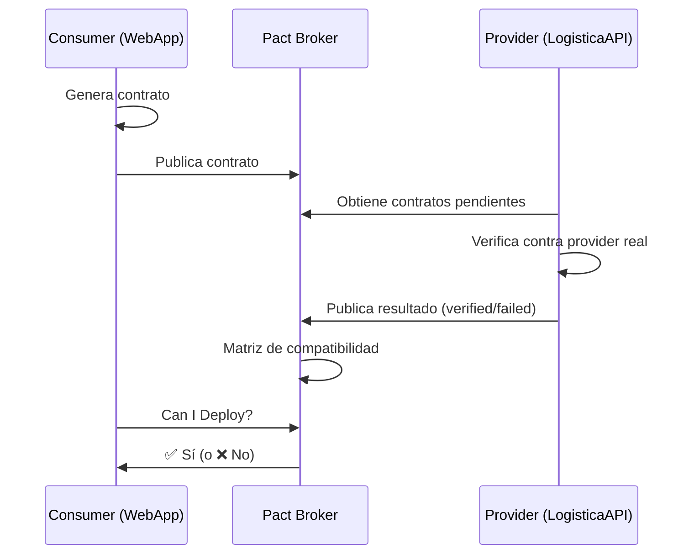

# 📘 10. Pact y Contract Tests en CI

- **Concepto Clave Asimilado:** Los contract tests con Pact verifican que las integraciones entre servicios (consumer y provider) cumplan con un contrato acordado, evitando breaking changes en despliegues independientes.

---

### 🧪 PARTE A: Laboratorio Express (Mini-Proyecto Aislado)

- **Desafío:** Pact en CI — Workflow que ejecuta tests Pact y verifica contratos entre consumer y provider.

**Instrucciones:**

1. Crear proyecto Pact básico:

**consumer/pom.xml** (fragmento):
```xml
<dependency>
  <groupId>au.com.dius.pact.provider</groupId>
  <artifactId>junit5</artifactId>
  <version>4.6.7</version>
  <scope>test</scope>
</dependency>
```

**Consumer test (`LogisticaConsumerPactTest.java`):**
```java
import au.com.dius.pact.consumer.dsl.PactDslJsonBody;
import au.com.dius.pact.consumer.dsl.PactDslWithProvider;
import au.com.dius.pact.consumer.junit5.PactConsumerTestExt;
import au.com.dius.pact.consumer.junit5.PactTestFor;
import au.com.dius.pact.core.model.RequestResponsePact;
import au.com.dius.pact.core.model.annotations.Pact;
import org.junit.jupiter.api.Test;
import org.junit.jupiter.api.extension.ExtendWith;

import java.util.Map;

import static org.junit.jupiter.api.Assertions.assertEquals;

@ExtendWith(PactConsumerTestExt.class)
@PactTestFor(providerName = "LogisticaAPI", port = "8080")
public class LogisticaConsumerPactTest {

  @Pact(consumer = "WebApp")
  public RequestResponsePact crearEnvioPact(PactDslWithProvider builder) {
    return builder
      .given("existe un envío pendiente")
      .uponReceiving("solicitar detalle de envío")
      .path("/api/envios/ENV-001")
      .method("GET")
      .willRespondWith()
      .status(200)
      .headers(Map.of("Content-Type", "application/json"))
      .body(new PactDslJsonBody()
        .stringType("codigo", "ENV-001")
        .stringType("destino", "Monterrey")
        .stringType("estado", "PENDIENTE")
        .object("tracking")
          .stringType("ubicacion", "CDMX")
          .stringType("evento", "RECIBIDO")
          .closeObject()
      )
      .toPact();
  }

  @Test
  @PactTestFor(pactMethod = "crearEnvioPact")
  public void testGetEnvio() {
    var response = new org.springframework.web.client.RestTemplate()
      .getForEntity("http://localhost:8080/api/envios/ENV-001", String.class);
    assertEquals(200, response.getStatusCodeValue());
  }
}
```

2. Crear `.github/workflows/pact-ci.yml`:

```yaml
name: Pact Contract Tests
on: [push]

jobs:
  consumer-tests:
    runs-on: ubuntu-latest
    steps:
      - uses: actions/checkout@v4
      - uses: actions/setup-java@v4
        with:
          java-version: '17'
          distribution: 'temurin'
          cache: maven
      - name: Ejecutar tests consumer
        run: mvn test -pl consumer -Dtest=*PactTest
      - name: Publicar contrato
        run: mvn pact:publish
        env:
          PACT_BROKER_URL: ${{ secrets.PACT_BROKER_URL }}
          PACT_BROKER_TOKEN: ${{ secrets.PACT_BROKER_TOKEN }}

  provider-verification:
    needs: consumer-tests
    runs-on: ubuntu-latest
    steps:
      - uses: actions/checkout@v4
      - uses: actions/setup-java@v4
        with:
          java-version: '17'
          distribution: 'temurin'
          cache: maven
      - name: Iniciar provider
        run: |
          mvn spring-boot:run -pl provider -DskipTests &
          npx wait-on http://localhost:8080/health
      - name: Verificar contratos
        run: mvn pact:verify -pl provider
        env:
          PACT_BROKER_URL: ${{ secrets.PACT_BROKER_URL }}
          PACT_BROKER_TOKEN: ${{ secrets.PACT_BROKER_TOKEN }}
```

---

### 🏗️ PARTE B: Evolución del Proyecto Principal de la Materia

- **Evolución del Software:** Contract Stage — Consumer tests publican contratos al Pact Broker, provider tests los verifican, y el broker actúa como fuente de verdad para compatibilidad.

**Instrucciones:**

1. Configurar Pact Broker (usando Docker Compose local):

Crear `pact-broker/docker-compose.yml`:

```yaml
version: '3.9'

services:
  postgres:
    image: postgres:16-alpine
    environment:
      POSTGRES_USER: pact
      POSTGRES_PASSWORD: pact123
      POSTGRES_DB: pact_broker
    volumes:
      - pact-postgres:/var/lib/postgresql/data

  pact-broker:
    image: pactfoundation/pact-broker:latest
    ports:
      - "9292:9292"
    environment:
      PACT_BROKER_DATABASE_USERNAME: pact
      PACT_BROKER_DATABASE_PASSWORD: pact123
      PACT_BROKER_DATABASE_HOST: postgres
      PACT_BROKER_DATABASE_NAME: pact_broker
      PACT_BROKER_DATABASE_ADAPTER: postgres
    depends_on:
      - postgres

volumes:
  pact-postgres:
```

2. Crear `.github/workflows/contract-stage.yml`:

```yaml
name: Contract Stage — Logística
on:
  push:
    branches: [main, develop]
  pull_request:
    branches: [main]

env:
  PACT_BROKER_URL: ${{ secrets.PACT_BROKER_URL }}
  PACT_BROKER_TOKEN: ${{ secrets.PACT_BROKER_TOKEN }}

jobs:
  # ============================================================
  # Consumer: WebApp — Genera y publica contratos
  # ============================================================
  consumer-webapp:
    name: 🌐 Consumer — WebApp
    runs-on: ubuntu-latest
    steps:
      - uses: actions/checkout@v4
      - uses: actions/setup-java@v4
        with:
          java-version: '17'
          distribution: 'temurin'
          cache: maven

      - name: Ejecutar Pact tests (WebApp)
        run: mvn test -pl consumer-webapp -Dtest=*PactTest -Dpact.verifier.publishResults=true

      - name: Publicar contratos WebApp
        run: |
          mvn pact:publish -pl consumer-webapp \
            -Dpact.broker.url=$PACT_BROKER_URL \
            -Dpact.broker.token=$PACT_BROKER_TOKEN

      - name: Verificar resultado
        run: |
          echo "✅ Contratos de WebApp publicados en Pact Broker"

  # ============================================================
  # Consumer: MobileApp — Genera y publica contratos
  # ============================================================
  consumer-mobile:
    name: 📱 Consumer — MobileApp
    runs-on: ubuntu-latest
    steps:
      - uses: actions/checkout@v4
      - uses: actions/setup-java@v4
        with:
          java-version: '17'
          distribution: 'temurin'
          cache: maven

      - name: Ejecutar Pact tests (MobileApp)
        run: mvn test -pl consumer-mobile -Dtest=*PactTest

      - name: Publicar contratos MobileApp
        run: |
          mvn pact:publish -pl consumer-mobile \
            -Dpact.broker.url=$PACT_BROKER_URL \
            -Dpact.broker.token=$PACT_BROKER_TOKEN

  # ============================================================
  # Provider: LogisticaAPI — Verifica contratos
  # ============================================================
  provider-verification:
    name: 🔌 Provider — LogisticaAPI
    needs: [consumer-webapp, consumer-mobile]
    runs-on: ubuntu-latest
    steps:
      - uses: actions/checkout@v4
      - uses: actions/setup-java@v4
        with:
          java-version: '17'
          distribution: 'temurin'
          cache: maven

      - name: Build y empaquetar provider
        run: mvn package -pl provider-api -DskipTests -B

      - name: Iniciar provider
        run: |
          java -jar provider-api/target/*.jar --server.port=8080 &
          npx wait-on http://localhost:8080/health --timeout 120000

      - name: Obtener contratos pendientes
        run: |
          curl -s -H "Authorization: Bearer $PACT_BROKER_TOKEN" \
            "$PACT_BROKER_URL/pacts/provider/LogisticaAPI/latest" \
            -o pacts-to-verify.json
          echo "Contratos descargados: $(jq '.pacts | length' pacts-to-verify.json)"

      - name: Verificar contratos
        run: |
          mvn pact:verify -pl provider-api \
            -Dpact.broker.url=$PACT_BROKER_URL \
            -Dpact.broker.token=$PACT_BROKER_TOKEN \
            -Dpact.verifier.publishResults=true

      - name: Taggear versión verificada
        if: success()
        run: |
          curl -X PUT \
            -H "Authorization: Bearer $PACT_BROKER_TOKEN" \
            "$PACT_BROKER_URL/pacticipants/LogisticaAPI/versions/${{ github.sha }}/tags/verified"
          echo "✅ Provider verificado y tagueado"

  # ============================================================
  # Can-i-deploy — Consulta al broker si es seguro desplegar
  # ============================================================
  can-i-deploy:
    name: ✅ Can I Deploy?
    needs: [consumer-webapp, consumer-mobile, provider-verification]
    runs-on: ubuntu-latest
    steps:
      - uses: actions/checkout@v4

      - name: Descargar Pact CLI
        run: |
          curl -fsSL https://github.com/pact-foundation/pact-ruby-standalone/releases/download/v2.0.5/pact-2.0.5-linux-x86_64.tar.gz \
            | tar xz -C /tmp
          echo "/tmp/pact/bin" >> $GITHUB_PATH

      - name: Verificar compatibilidad
        run: |
          pact broker can-i-deploy \
            --pacticipant LogisticaAPI \
            --version ${{ github.sha }} \
            --to-environment production \
            --broker-base-url $PACT_BROKER_URL \
            --broker-token $PACT_BROKER_TOKEN

      - name: Resultado
        run: echo "✅ Es seguro desplegar — todos los contratos compatibles"
```

3. Provider test (`provider-api/src/test/java/LogisticaProviderPactTest.java`):

```java
import au.com.dius.pact.provider.junit5.HttpTestTarget;
import au.com.dius.pact.provider.junit5.PactVerificationContext;
import au.com.dius.pact.provider.junitsupport.IgnoreNoPactsToVerify;
import au.com.dius.pact.provider.junitsupport.Provider;
import au.com.dius.pact.provider.junitsupport.loader.PactBroker;
import au.com.dius.pact.provider.junitsupport.loader.PactBrokerAuth;
import org.junit.jupiter.api.BeforeEach;
import org.junit.jupiter.api.TestTemplate;
import org.junit.jupiter.api.extension.ExtendWith;

@Provider("LogisticaAPI")
@PactBroker(
  url = "${pact.broker.url}",
  authentication = @PactBrokerAuth(token = "${pact.broker.token}")
)
@IgnoreNoPactsToVerify
public class LogisticaProviderPactTest {

  @BeforeEach
  void setUp(PactVerificationContext context) {
    context.setTarget(new HttpTestTarget("localhost", 8080));
  }

  @TestTemplate
  @ExtendWith(PactVerificationInvocationContextProvider.class)
  void pactVerificationTestTemplate(PactVerificationContext context) {
    context.verifyInteraction();
  }
}
```

**Flujo de Contract Testing:**


**Matriz de compatibilidad:**

| Versión Provider | Versión WebApp | Versión MobileApp | Compatible |
| ---------------- | -------------- | ----------------- | ---------- |
| v1.0             | v1.0           | v1.0              | ✅         |
| v1.1             | v1.0           | v1.0              | ✅         |
| v2.0             | v1.0           | v1.0              | ❌         |
| v2.0             | v2.0           | v1.1              | ✅         |

**Conceptos clave:**

| Concepto          | Propósito                                      |
| ----------------- | ---------------------------------------------- |
| Consumer          | Quien realiza la llamada HTTP                   |
| Provider          | Quien expone el endpoint                       |
| Pact              | Contrato JSON generado por el consumer         |
| Pact Broker       | Repositorio central de contratos               |
| can-i-deploy      | Gate que verifica compatibilidad antes de deploy|
| `pact:verify`     | Valida que el provider cumple los contratos    |
| `pact:publish`    | Sube contratos al broker                       |

---

**✅ Criterio de éxito:** Los consumers publican contratos al broker, el provider los verifica contra su API real, can-i-deploy confirma compatibilidad, y el pipeline se bloquea si hay breaking changes.
