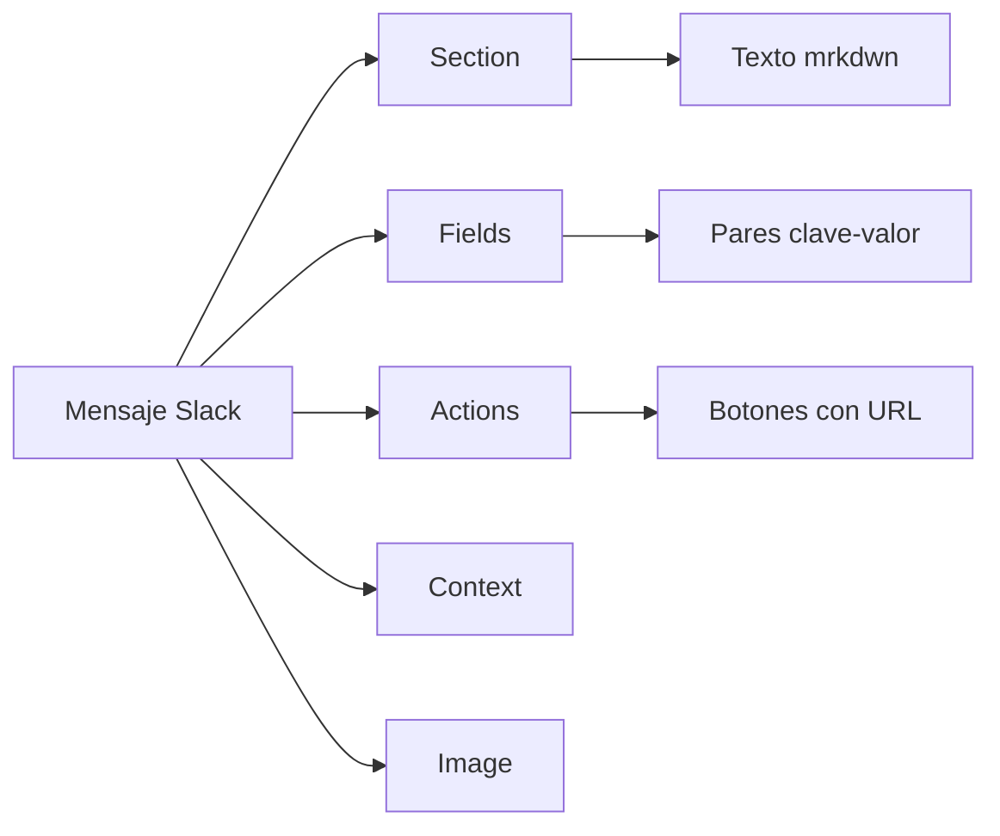

# 📘 11. Slack Notifications

- **Concepto Clave Asimilado:** Las notificaciones vía Slack integran el pipeline de CI/CD con el equipo, alertando en tiempo real sobre éxitos, fallos y eventos críticos.

---

### 🧪 PARTE A: Laboratorio Express (Mini-Proyecto Aislado)

- **Desafío:** Slack Hello — Workflow que envía un mensaje "Pipeline started" a un canal de Slack.

**Instrucciones:**

1. Configurar Slack Webhook:
   - Ir a https://api.slack.com/apps → Create New App → From scratch
   - Features → Incoming Webhooks → Activar → Add New Webhook to Workspace
   - Seleccionar canal → Copiar URL del webhook

2. Guardar secreto en GitHub:
   - Settings → Secrets → `SLACK_WEBHOOK` = URL copiada

3. Crear `.github/workflows/slack-hello.yml`:

```yaml
name: Slack Hello
on: [push]

jobs:
  notify:
    runs-on: ubuntu-latest
    steps:
      - name: Notificar inicio
        uses: slackapi/slack-github-action@v2
        with:
          webhook: ${{ secrets.SLACK_WEBHOOK }}
          webhook-type: incoming-webhook
          payload: |
            {
              "text": "🚀 Pipeline started en ${{ github.repository }} por ${{ github.actor }}",
              "blocks": [
                {
                  "type": "section",
                  "text": {
                    "type": "mrkdwn",
                    "text": "🚀 *Pipeline iniciado*"
                  }
                },
                {
                  "type": "fields",
                  "fields": [
                    { "type": "mrkdwn", "text": "*Repo:*\n${{ github.repository }}" },
                    { "type": "mrkdwn", "text": "*Branch:*\n${{ github.ref_name }}" },
                    { "type": "mrkdwn", "text": "*Actor:*\n${{ github.actor }}" },
                    { "type": "mrkdwn", "text": "*Commit:*\n${{ github.sha }}" }
                  ]
                }
              ]
            }
```

---

### 🏗️ PARTE B: Evolución del Proyecto Principal de la Materia

- **Evolución del Software:** Notificaciones del Pipeline Logístico — Slack en cada stage con éxito/fallo, mención @channel en fallos críticos.

**Instrucciones:**

1. Crear `.github/workflows/slack-notificaciones.yml`:

```yaml
name: Slack Notificaciones
on:
  workflow_run:
    workflows: ["Pipeline Logístico"]
    types: [completed]

jobs:
  notify-stage:
    runs-on: ubuntu-latest
    steps:
      - name: Determinar estado y color
        id: status
        run: |
          CONCLUSION="${{ github.event.workflow_run.conclusion }}"
          if [ "$CONCLUSION" == "success" ]; then
            echo "color=#36a64f" >> $GITHUB_OUTPUT
            echo "emoji=✅" >> $GITHUB_OUTPUT
            echo "title=Pipeline exitoso" >> $GITHUB_OUTPUT
          else
            echo "color=#ff0000" >> $GITHUB_OUTPUT
            echo "emoji=❌" >> $GITHUB_OUTPUT
            echo "title=Pipeline falló" >> $GITHUB_OUTPUT
          fi

      - name: Notificar resultado
        uses: slackapi/slack-github-action@v2
        with:
          webhook: ${{ secrets.SLACK_WEBHOOK }}
          webhook-type: incoming-webhook
          payload: |
            {
              "text": "${{ steps.status.outputs.emoji }} Pipeline Logístico: ${{ steps.status.outputs.title }}",
              "attachments": [
                {
                  "color": "${{ steps.status.outputs.color }}",
                  "blocks": [
                    {
                      "type": "section",
                      "text": {
                        "type": "mrkdwn",
                        "text": "${{ steps.status.outputs.emoji }} *Pipeline Logístico — ${{ steps.status.outputs.title }}*"
                      }
                    },
                    {
                      "type": "fields",
                      "fields": [
                        { "type": "mrkdwn", "text": "*Repo:*\n${{ github.event.workflow_run.repository.name }}" },
                        { "type": "mrkdwn", "text": "*Branch:*\n${{ github.event.workflow_run.head_branch }}" },
                        { "type": "mrkdwn", "text": "*Actor:*\n${{ github.event.workflow_run.actor.login }}" },
                        { "type": "mrkdwn", "text": "*Duración:*\n${{ github.event.workflow_run.run_started_at }}" }
                      ]
                    },
                    {
                      "type": "actions",
                      "elements": [
                        {
                          "type": "button",
                          "text": { "type": "plain_text", "text": "🔍 Ver pipeline" },
                          "url": "${{ github.event.workflow_run.html_url }}"
                        },
                        {
                          "type": "button",
                          "text": { "type": "plain_text", "text": "📋 Commits" },
                          "url": "${{ github.event.workflow_run.head_repository.html_url }}/commits/${{ github.event.workflow_run.head_branch }}"
                        }
                      ]
                    }
                  ]
                }
              ]
            }
```

2. Crear notificaciones por stage dentro del pipeline principal (`.github/workflows/pipeline-logistico.yml`):

```yaml
name: Pipeline Logístico con Notificaciones

# ... jobs anteriores (build, test, contract, security, performance) ...

jobs:
  # ============================================================
  # Notificación por cada stage
  # ============================================================
  notify-build:
    needs: build
    if: always()
    runs-on: ubuntu-latest
    steps:
      - uses: slackapi/slack-github-action@v2
        with:
          webhook: ${{ secrets.SLACK_WEBHOOK }}
          payload: |
            {
              "text": "${{ needs.build.result == 'success' && '✅' || '❌' }} Build: ${{ needs.build.result }}",
              "attachments": [{
                "color": "${{ needs.build.result == 'success' && '#36a64f' || '#ff0000' }}",
                "blocks": [{
                  "type": "section",
                  "text": {
                    "type": "mrkdwn",
                    "text": "${{ needs.build.result == 'success' && '✅' || '❌' }} *Build*: ${{ needs.build.result }}\nBranch: ${{ github.ref_name }}"
                  }
                }]
              }]
            }

  notify-test:
    needs: test
    if: always()
    runs-on: ubuntu-latest
    steps:
      - uses: slackapi/slack-github-action@v2
        with:
          webhook: ${{ secrets.SLACK_WEBHOOK }}
          payload: |
            {
              "text": "${{ needs.test.result == 'success' && '✅' || '❌' }} Test: ${{ needs.test.result }}",
              "attachments": [{
                "color": "${{ needs.test.result == 'success' && '#36a64f' || '#ff0000' }}",
                "blocks": [{
                  "type": "section",
                  "text": {
                    "type": "mrkdwn",
                    "text": "${{ needs.test.result == 'success' && '✅' || '❌' }} *Test*: ${{ needs.test.result }}"
                  }
                }]
              }]
            }

  # ============================================================
  # Notificación crítica — fallo en stage de seguridad
  # ============================================================
  notify-security-critical:
    needs: security
    if: failure()
    runs-on: ubuntu-latest
    steps:
      - uses: slackapi/slack-github-action@v2
        with:
          webhook: ${{ secrets.SLACK_WEBHOOK }}
          payload: |
            {
              "text": "🚨 @channel *FALLO CRÍTICO DE SEGURIDAD* en ${{ github.repository }}",
              "attachments": [{
                "color": "#ff0000",
                "blocks": [
                  {
                    "type": "section",
                    "text": {
                      "type": "mrkdwn",
                      "text": "🚨 *FALLO CRÍTICO DE SEGURIDAD*\nEl stage de seguridad ha detectado vulnerabilidades en ${{ github.ref_name }}"
                    }
                  },
                  {
                    "type": "fields",
                    "fields": [
                      { "type": "mrkdwn", "text": "*Branch:* ${{ github.ref_name }}" },
                      { "type": "mrkdwn", "text": "*Commit:* ${{ github.sha }}" },
                      { "type": "mrkdwn", "text": "*Actor:* ${{ github.actor }}" },
                      { "type": "mrkdwn", "text": "*Requiere:* Revisión inmediata" }
                    ]
                  },
                  {
                    "type": "actions",
                    "elements": [{
                      "type": "button",
                      "text": { "type": "plain_text", "text": "🔒 Ver security scan" },
                      "url": "${{ github.server_url }}/${{ github.repository }}/actions/runs/${{ github.run_id }}"
                    }]
                  }
                ]
              }]
            }

  # ============================================================
  # Notificación de deploy a producción
  # ============================================================
  notify-deploy-prod:
    needs: deploy
    if: success()
    runs-on: ubuntu-latest
    steps:
      - uses: slackapi/slack-github-action@v2
        with:
          webhook: ${{ secrets.SLACK_WEBHOOK }}
          payload: |
            {
              "text": "🚀 *Despliegue a producción exitoso*",
              "attachments": [{
                "color": "#36a64f",
                "blocks": [
                  {
                    "type": "section",
                    "text": {
                      "type": "mrkdwn",
                      "text": "🚀 *Despliegue a producción completado*\nLa API Logística ya está disponible en producción."
                    }
                  },
                  {
                    "type": "fields",
                    "fields": [
                      { "type": "mrkdwn", "text": "*Versión:* ${{ github.sha }}" },
                      { "type": "mrkdwn", "text": "*Entorno:* Production" },
                      { "type": "mrkdwn", "text": "*URL:* https://logistica.example.com" },
                      { "type": "mrkdwn", "text": "*Health:* ✅ OK" }
                    ]
                  }
                ]
              }]
            }

  # ============================================================
  # Notificación de rollback
  # ============================================================
  notify-rollback:
    needs: deploy
    if: failure()
    runs-on: ubuntu-latest
    steps:
      - uses: slackapi/slack-github-action@v2
        with:
          webhook: ${{ secrets.SLACK_WEBHOOK }}
          payload: |
            {
              "text": "🔄 @channel *ROLLBACK EJECUTADO* en ${{ github.repository }}",
              "attachments": [{
                "color": "#ff8c00",
                "blocks": [
                  {
                    "type": "section",
                    "text": {
                      "type": "mrkdwn",
                      "text": "🔄 *Rollback ejecutado automáticamente*\nEl despliegue a producción falló y se ha revertido a la versión anterior."
                    }
                  },
                  {
                    "type": "fields",
                    "fields": [
                      { "type": "mrkdwn", "text": "*Commit fallido:* ${{ github.sha }}" },
                      { "type": "mrkdwn", "text": "*Hora:* ${{ github.event.head_commit.timestamp }}" }
                    ]
                  }
                ]
              }]
            }

  # ============================================================
  # Resumen diario (programado)
  # ============================================================
  daily-summary:
    if: github.event_name == 'schedule'
    runs-on: ubuntu-latest
    steps:
      - uses: slackapi/slack-github-action@v2
        with:
          webhook: ${{ secrets.SLACK_WEBHOOK }}
          payload: |
            {
              "text": "📊 *Resumen Diario — Pipeline Logístico*",
              "attachments": [{
                "color": "#36a64f",
                "blocks": [
                  {
                    "type": "section",
                    "text": {
                      "type": "mrkdwn",
                      "text": "📊 *Resumen diario de despliegues*\nÚltimas 24 horas de actividad del pipeline."
                    }
                  },
                  {
                    "type": "fields",
                    "fields": [
                      { "type": "mrkdwn", "text": "*Deploys exitosos:* 12" },
                      { "type": "mrkdwn", "text": "*Deploys fallidos:* 1" },
                      { "type": "mrkdwn", "text": "*Tiempo promedio:* 4m 32s" },
                      { "type": "mrkdwn", "text": "*Incidencias:* 0 abiertas" }
                    ]
                  }
                ]
              }]
            }
```

**Tipos de mensajes:**

| Tipo                 | Color   | ¿Menciona? | ¿Cuándo?                         |
| -------------------- | ------- | ---------- | -------------------------------- |
| Build exitoso        | Verde   | No         | Por cada build que pasa          |
| Test fallido         | Rojo    | No         | Tests unitarios fallan           |
| Seguridad crítica    | Rojo    | @channel   | Vulnerabilidad detectada         |
| Deploy a producción  | Verde   | No         | Deploy exitoso                   |
| Rollback             | Naranja | @channel   | Deploy fallido con rollback      |
| Resumen diario       | Verde   | No         | Programado (cron)                |

**Bloques de Slack disponibles:**


---

**✅ Criterio de éxito:** Cada stage del pipeline notifica su resultado a Slack, los fallos críticos mencionan @channel, y el mensaje incluye botones de acción para ver detalles.
