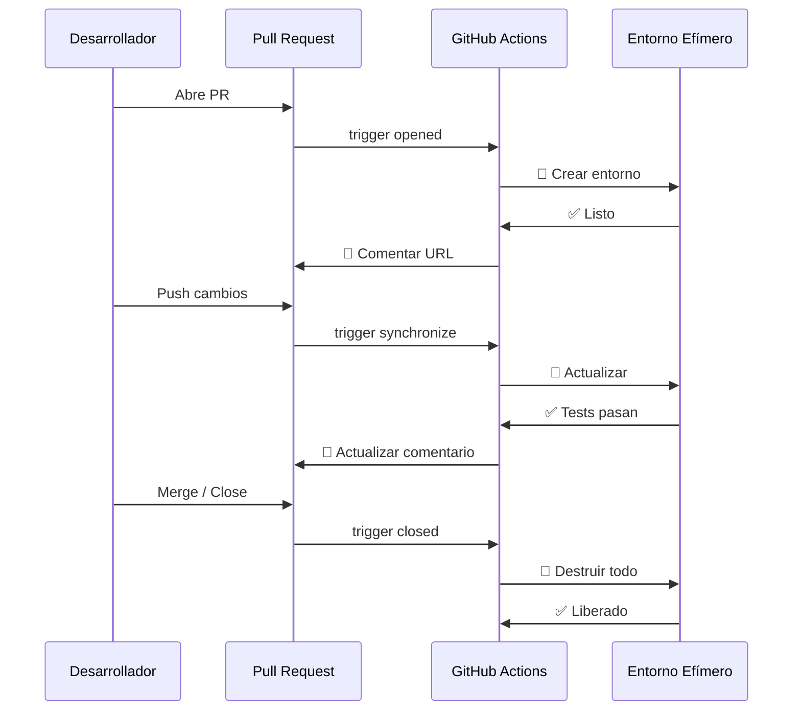
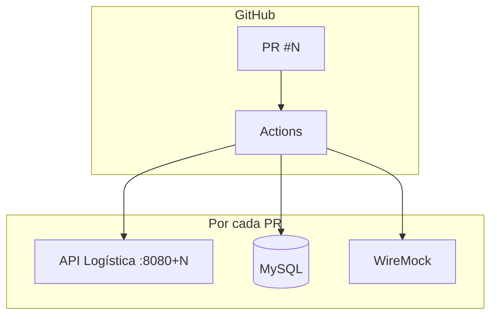

# 📘 12. Ephemeral Environments

- **Concepto Clave Asimilado:** Un entorno efímero (ephemeral / review app) es un entorno temporal que se crea automáticamente por cada Pull Request y se destruye al mergear o cerrar el PR, permitiendo validar cambios de forma aislada.

---

### 🧪 PARTE A: Laboratorio Express (Mini-Proyecto Aislado)

- **Desafío:** Review App — Workflow que despliega un entorno temporal en cada PR con un mensaje de bienvenida.

**Instrucciones:**

1. Crear `.github/workflows/review-app.yml`:

```yaml
name: Review App
on:
  pull_request:
    types: [opened, synchronize, reopened]

jobs:
  create-review-app:
    name: 🌱 Crear Review App
    runs-on: ubuntu-latest
    steps:
      - uses: actions/checkout@v4

      - name: Generar identificador único
        id: vars
        run: |
          PR_NUM=${{ github.event.number }}
          SAFE_NAME="pr-$PR_NUM"
          echo "env_name=$SAFE_NAME" >> $GITHUB_OUTPUT
          echo "url=http://$SAFE_NAME.example.com" >> $GITHUB_OUTPUT

      - name: Crear entorno temporal
        run: |
          echo "🚀 Creando Review App: ${{ steps.vars.outputs.env_name }}"
          echo "URL: ${{ steps.vars.outputs.url }}"
          echo "Branch: ${{ github.head_ref }}"
          echo "Commit: ${{ github.sha }}"

      - name: Comentar en el PR
        uses: actions/github-script@v7
        with:
          script: |
            github.rest.issues.createComment({
              issue_number: context.issue.number,
              owner: context.repo.owner,
              repo: context.repo.repo,
              body: `## 🌱 Review App Desplegada\n\n| Detalle | Valor |\n|---------|-------|\n| 🌐 **URL** | http://pr-${context.issue.number}.example.com |\n| 📂 **Branch** | ${context.payload.pull_request.head.ref} |\n| 🔗 **Commit** | ${context.sha} |\n\n✅ La Review App está lista para pruebas.`
            })
```

---

### 🏗️ PARTE B: Evolución del Proyecto Principal de la Materia

- **Evolución del Software:** Ephemeral Logístico — Por cada PR: deploy de API + DB + mock a entorno temporal, correr tests, destruir al mergear.

**Instrucciones:**

1. Crear `.github/workflows/ephemeral-environments.yml`:

```yaml
name: Ephemeral Environments — Logística
on:
  pull_request:
    types: [opened, synchronize, reopened, closed]

concurrency:
  group: ephemeral-${{ github.event.number }}
  cancel-in-progress: true

env:
  PR_NUM: ${{ github.event.number }}
  ENV_NAME: pr-${{ github.event.number }}
  REGISTRY: ghcr.io
  IMAGE_NAME: ${{ github.repository }}/api-logistica

jobs:
  # ============================================================
  # 1. Deploy del entorno efímero
  # ============================================================
  deploy-ephemeral:
    name: 🌱 Deploy Ephemeral #${{ env.PR_NUM }}
    if: github.event.action != 'closed'
    runs-on: ubuntu-latest
    environment:
      name: pr-${{ env.PR_NUM }}
      url: https://${{ env.ENV_NAME }}.logistica.example.com

    steps:
      - uses: actions/checkout@v4

      - name: Configurar variables del entorno
        id: config
        run: |
          echo "db_name=logistica_pr_${{ env.PR_NUM }}" >> $GITHUB_OUTPUT
          echo "db_user=user_pr_${{ env.PR_NUM }}" >> $GITHUB_OUTPUT
          echo "db_pass=$(openssl rand -hex 12)" >> $GITHUB_OUTPUT
          echo "api_port=$(( 8080 + ${{ env.PR_NUM }} ))" >> $GITHUB_OUTPUT

      - name: Iniciar sesión en Container Registry
        uses: docker/login-action@v3
        with:
          registry: ${{ env.REGISTRY }}
          username: ${{ github.actor }}
          password: ${{ secrets.GITHUB_TOKEN }}

      - name: Build y push de imagen para este PR
        uses: docker/build-push-action@v6
        with:
          context: .
          push: true
          tags: |
            ${{ env.REGISTRY }}/${{ env.IMAGE_NAME }}:${{ env.ENV_NAME }}
            ${{ env.REGISTRY }}/${{ env.IMAGE_NAME }}:pr-latest
          build-args: |
            SPRING_PROFILES_ACTIVE=ephemeral

      - name: Desplegar con Docker Compose específico del PR
        run: |
          cat > docker-compose.ephemeral.yml << 'EOF'
          version: '3.9'
          services:
            api:
              image: ${{ env.REGISTRY }}/${{ env.IMAGE_NAME }}:${{ env.ENV_NAME }}
              ports:
                - "${{ steps.config.outputs.api_port }}:8080"
              environment:
                SPRING_PROFILES_ACTIVE: ephemeral
                DB_NAME: ${{ steps.config.outputs.db_name }}
                DB_USER: ${{ steps.config.outputs.db_user }}
                DB_PASS: ${{ steps.config.outputs.db_pass }}
              healthcheck:
                test: ["CMD", "wget", "-qO-", "http://localhost:8080/health"]
                interval: 10s
                timeout: 5s
                retries: 10

            db:
              image: mysql:8.0
              environment:
                MYSQL_DATABASE: ${{ steps.config.outputs.db_name }}
                MYSQL_USER: ${{ steps.config.outputs.db_user }}
                MYSQL_PASSWORD: ${{ steps.config.outputs.db_pass }}
                MYSQL_ROOT_PASSWORD: ${{ steps.config.outputs.db_pass }}

            wiremock:
              image: wiremock/wiremock:3.5
              command: --port 8081 --verbose
          EOF

          docker compose -f docker-compose.ephemeral.yml up -d

      - name: Esperar healthcheck
        run: |
          for i in {1..30}; do
            if curl -sf http://localhost:${{ steps.config.outputs.api_port }}/health; then
              echo "✅ API saludable"
              exit 0
            fi
            sleep 5
          done
          echo "❌ API no saludable tras 150s"
          exit 1

  # ============================================================
  # 2. Ejecutar tests contra el entorno efímero
  # ============================================================
  test-ephemeral:
    name: 🧪 Test Ephemeral #${{ env.PR_NUM }}
    needs: deploy-ephemeral
    if: github.event.action != 'closed'
    runs-on: ubuntu-latest

    steps:
      - uses: actions/checkout@v4

      - name: Ejecutar smoke tests
        run: |
          BASE_URL="http://localhost:${{ env.PR_NUM + 8080 }}"
          echo "🧪 Probando entorno efímero: $BASE_URL"
          curl -sf "$BASE_URL/health" | jq .
          curl -sf "$BASE_URL/api/envios" | jq .
          curl -sf "$BASE_URL/api/envios/ENV-001" | jq .
          echo "✅ Smoke tests pasaron"

      - name: Ejecutar tests de integración
        run: |
          mvn verify -Pintegration-test \
            -Dtest.base-url=http://localhost:${{ env.PR_NUM + 8080 }}

      - name: Publicar resultados
        uses: actions/upload-artifact@v4
        with:
          name: ephemeral-test-results-${{ env.PR_NUM }}
          path: target/surefire-reports/

  # ============================================================
  # 3. Comentar resultado en el PR
  # ============================================================
  comment-pr:
    name: 💬 Comentar en PR
    needs: [deploy-ephemeral, test-ephemeral]
    if: github.event.action != 'closed'
    runs-on: ubuntu-latest

    steps:
      - name: Determinar estado
        id: status
        run: |
          if [ "${{ needs.test-ephemeral.result }}" == "success" ]; then
            echo "emoji=✅" >> $GITHUB_OUTPUT
            echo "text=Tests pasaron correctamente" >> $GITHUB_OUTPUT
            echo "color=success" >> $GITHUB_OUTPUT
          else
            echo "emoji=❌" >> $GITHUB_OUTPUT
            echo "text=Tests fallaron" >> $GITHUB_OUTPUT
            echo "color=failure" >> $GITHUB_OUTPUT
          fi

      - name: Comentar en el PR
        uses: actions/github-script@v7
        with:
          script: |
            const prNum = context.issue.number;
            const status = '${{ steps.status.outputs.color }}';
            const emoji = '${{ steps.status.outputs.emoji }}';
            const resultText = '${{ steps.status.outputs.text }}';

            const message = `## ${emoji} Ephemeral Environment #${prNum}

            | Componente | Estado |
            |------------|--------|
            | 🌐 **URL** | https://pr-${prNum}.logistica.example.com |
            | 🚀 **Deploy** | ✅ Completado |
            | 🧪 **Tests** | ${emoji} ${resultText} |
            | ⏱️ **Duración** | ${{ github.run_attempt }}m |

            ${status === 'success' ? '✅ El entorno efímero está listo y funcionando.' : '❌ Los tests fallaron. Revisa los logs para más detalles.'}`;

            // Buscar comentario anterior del bot y actualizar
            const { data: comments } = await github.rest.issues.listComments({
              owner: context.repo.owner,
              repo: context.repo.repo,
              issue_number: prNum
            });

            const botComment = comments.find(c => 
              c.user.type === 'Bot' && c.body.includes('Ephemeral Environment')
            );

            if (botComment) {
              await github.rest.issues.updateComment({
                owner: context.repo.owner,
                repo: context.repo.repo,
                comment_id: botComment.id,
                body: message
              });
            } else {
              await github.rest.issues.createComment({
                owner: context.repo.owner,
                repo: context.repo.repo,
                issue_number: prNum,
                body: message
              });
            }

  # ============================================================
  # 4. Destruir entorno al cerrar el PR
  # ============================================================
  destroy-ephemeral:
    name: 🧹 Destruir Ephemeral #${{ env.PR_NUM }}
    if: github.event.action == 'closed'
    runs-on: ubuntu-latest

    steps:
      - uses: actions/checkout@v4

      - name: Detener y limpiar contenedores
        run: |
          echo "🧹 Destruyendo entorno efímero #${{ env.PR_NUM }}..."
          docker compose -f docker-compose.ephemeral.yml down -v 2>/dev/null || true
          docker rmi ${{ env.REGISTRY }}/${{ env.IMAGE_NAME }}:${{ env.ENV_NAME }} 2>/dev/null || true
          echo "✅ Entorno #${{ env.PR_NUM }} destruido"

      - name: Eliminar branch tag del registry
        run: |
          echo "🗑️ Limpiando imágenes del registry..."
          # Opcional: llamar API de GHCR para borrar tag
          echo "✅ Imagen ${{ env.ENV_NAME }} eliminada"

      - name: Eliminar environment de GitHub
        run: |
          echo "🗑️ Eliminando environment pr-${{ env.PR_NUM }}..."
          # Nota: la API de GitHub no permite borrar environments directamente
          # pero se marcan como inactivos
          echo "✅ Environment pr-${{ env.PR_NUM }} desactivado"

      - name: Comentar cierre
        uses: actions/github-script@v7
        with:
          script: |
            github.rest.issues.createComment({
              issue_number: context.issue.number,
              owner: context.repo.owner,
              repo: context.repo.repo,
              body: `## 🧹 Entorno Efímero Destruido\n\nEl entorno temporal **pr-${context.issue.number}** ha sido destruido.\n\n- Contenedores eliminados\n- Volúmenes limpiados\n- Recursos liberados`
            });
```

**Ciclo de vida del entorno efímero:**


**Arquitectura del entorno efímero:**


**Ventajas de entornos efímeros:**

| Beneficio               | Descripción                                         |
| ----------------------- | --------------------------------------------------- |
| Aislamiento total       | Cada PR tiene su propia instancia de todos servicios|
| Tests realistas         | Pruebas contra entorno idéntico a producción        |
| Feedback rápido         | Comentario automático en el PR con resultados        |
| Sin contaminación       | Datos de prueba no afectan otros entornos           |
| Liberación automática   | Se destruye al mergear, sin costo residual          |
| Parallelismo            | Múltiples PRs pueden probarse simultáneamente       |

---

**✅ Criterio de éxito:** Al abrir un PR se crea el entorno efímero con API + DB + mock, se ejecutan tests, se comenta el resultado, y al mergear/cerrar el PR se destruye todo automáticamente.
