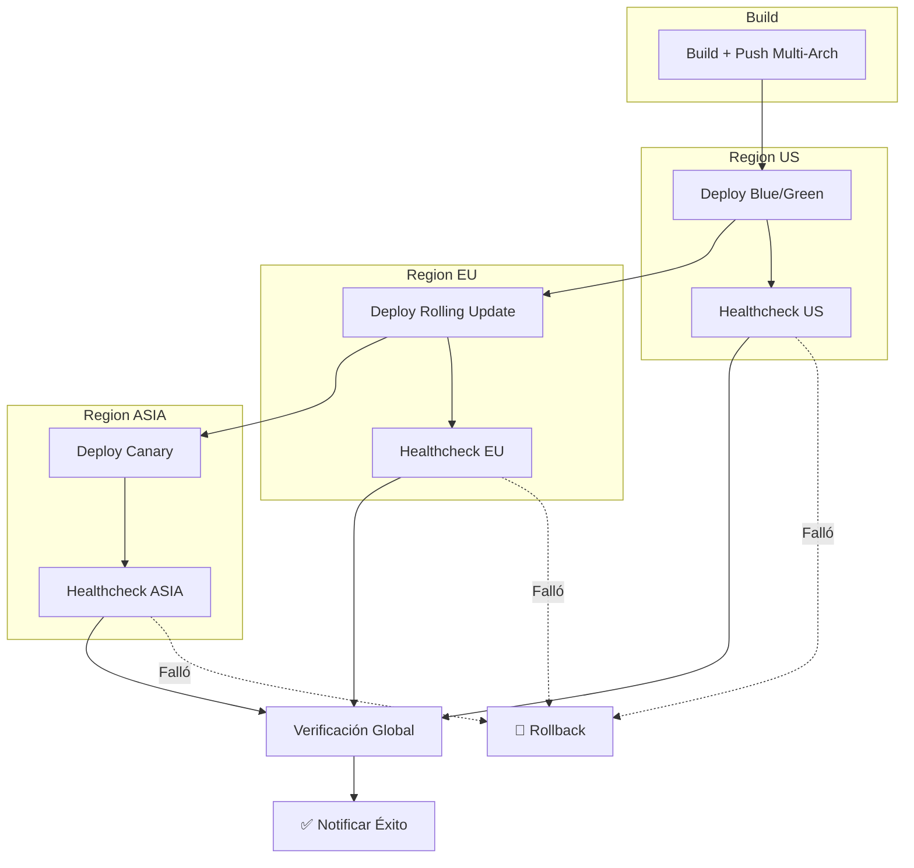

# 📘 13. Multi-Org Deployment

- **Concepto Clave Asimilado:** El despliegue multi-entorno organiza la entrega de software a través de múltiples entornos (dev, staging, prod) y regiones geográficas con approvals progresivos y rollback automático.

---

### 🧪 PARTE A: Laboratorio Express (Mini-Proyecto Aislado)

- **Desafío:** Deploy Multi-Env — Workflow con `environment: [dev, staging, prod]` secuencial con approvals en producción.

**Instrucciones:**

1. Crear entornos en GitHub:
   - Settings → Environments → `development` (sin protección)
   - Settings → Environments → `staging` (1 reviewer)
   - Settings → Environments → `production` (2 reviewers, 5 min wait)

2. Crear `.github/workflows/deploy-multi-env.yml`:

```yaml
name: Deploy Multi-Env
on:
  push:
    branches: [main]

jobs:
  # ============================================================
  # Deploy a Dev (automático)
  # ============================================================
  deploy-dev:
    name: 🚀 Deploy → Dev
    runs-on: ubuntu-latest
    environment:
      name: development
      url: https://dev.example.com

    steps:
      - uses: actions/checkout@v4
      - name: Deploy
        run: echo "✅ Desplegando a development..."
      - name: Smoke test
        run: curl -f https://dev.example.com/health

  # ============================================================
  # Deploy a Staging (requiere 1 approval)
  # ============================================================
  deploy-staging:
    name: 🚀 Deploy → Staging
    needs: deploy-dev
    runs-on: ubuntu-latest
    environment:
      name: staging
      url: https://staging.example.com

    steps:
      - uses: actions/checkout@v4
      - name: Deploy
        run: echo "✅ Desplegando a staging..."
      - name: Integration tests
        run: echo "🧪 Integration tests..."
      - name: Smoke test
        run: curl -f https://staging.example.com/health

  # ============================================================
  # Deploy a Production (requiere 2 approvals + 5 min wait)
  # ============================================================
  deploy-production:
    name: 🚀 Deploy → Production
    needs: deploy-staging
    runs-on: ubuntu-latest
    environment:
      name: production
      url: https://example.com

    steps:
      - uses: actions/checkout@v4
      - name: Deploy
        run: echo "✅ Desplegando a producción..."
      - name: Healthcheck
        run: curl -f https://example.com/health
      - name: Smoke test
        run: echo "✅ Smoke test en producción OK"
```

---

### 🏗️ PARTE B: Evolución del Proyecto Principal de la Materia

- **Evolución del Software:** Deploy Logístico Multi-Región — Despliegue a US/EU/ASIA con approvals manuales en prod y rollback automático en fallo.

**Instrucciones:**

1. Crear `.github/workflows/deploy-multi-region.yml`:

```yaml
name: Deploy Multi-Región — Logística
on:
  workflow_dispatch:
    inputs:
      version:
        description: 'Versión a desplegar (tag o SHA)'
        required: true
        default: 'latest'
      regions:
        description: 'Regiones objetivo (coma-separado)'
        required: true
        default: 'us,eu,asia'

env:
  VERSION: ${{ github.event.inputs.version || github.sha }}
  DOCKER_IMAGE: ghcr.io/${{ github.repository }}/api-logistica

jobs:
  # ============================================================
  # Build y push de imagen multi-arquitectura
  # ============================================================
  build:
    name: 📦 Build + Push
    runs-on: ubuntu-latest
    outputs:
      digest: ${{ steps.push.outputs.digest }}

    steps:
      - uses: actions/checkout@v4
        with:
          ref: ${{ env.VERSION }}

      - name: Login a GHCR
        uses: docker/login-action@v3
        with:
          registry: ghcr.io
          username: ${{ github.actor }}
          password: ${{ secrets.GITHUB_TOKEN }}

      - name: Build y push multi-arch
        uses: docker/build-push-action@v6
        id: push
        with:
          context: .
          push: true
          platforms: linux/amd64,linux/arm64
          tags: |
            ${{ env.DOCKER_IMAGE }}:${{ env.VERSION }}
            ${{ env.DOCKER_IMAGE }}:latest
          cache-from: type=gha
          cache-to: type=gha,mode=max

  # ============================================================
  # Deploy a US (despliegue azul/verde)
  # ============================================================
  deploy-us:
    name: 🇺🇸 Deploy US
    needs: build
    runs-on: ubuntu-latest
    environment:
      name: us-production
      url: https://us.logistica.example.com

    env:
      REGION: us
      KUBE_NAMESPACE: logistica-us
      REPLICAS: 4

    steps:
      - uses: actions/checkout@v4

      - name: Configurar kubectl para US
        run: |
          echo "Configurando cluster US..."
          # kubectl config set-cluster us-cluster ...
          echo "✅ kubectl configurado para US"

      - name: Despliegue blue/green US
        run: |
          echo "🔄 Desplegando en US (blue/green)..."
          echo "Imagen: ${{ env.DOCKER_IMAGE }}:${{ env.VERSION }}"
          echo "Réplicas: ${{ env.REPLICAS }}"

      - name: Smoke test US
        run: |
          echo "🧪 Smoke test en US..."
          # curl -f https://us.logistica.example.com/health

      - name: Healthcheck US
        run: |
          echo "✅ Healthcheck US: OK"

  # ============================================================
  # Deploy a EU (despliegue rolling)
  # ============================================================
  deploy-eu:
    name: 🇪🇺 Deploy EU
    needs: [build, deploy-us]
    runs-on: ubuntu-latest
    environment:
      name: eu-production
      url: https://eu.logistica.example.com

    env:
      REGION: eu
      KUBE_NAMESPACE: logistica-eu
      REPLICAS: 6

    steps:
      - uses: actions/checkout@v4

      - name: Configurar kubectl para EU
        run: echo "✅ kubectl configurado para EU"

      - name: Rolling update EU
        run: |
          echo "🔄 Rolling update en EU..."
          echo "Imagen: ${{ env.DOCKER_IMAGE }}:${{ env.VERSION }}"
          echo "Max surge: 25%, Max unavailable: 25%"

      - name: Smoke test EU
        run: echo "✅ Smoke test EU: OK"

  # ============================================================
  # Deploy a ASIA (requiere approval adicional)
  # ============================================================
  deploy-asia:
    name: 🌏 Deploy ASIA
    needs: [build, deploy-eu]
    runs-on: ubuntu-latest
    environment:
      name: asia-production
      url: https://asia.logistica.example.com

    env:
      REGION: asia
      KUBE_NAMESPACE: logistica-asia
      REPLICAS: 3

    steps:
      - uses: actions/checkout@v4

      - name: Configurar kubectl para ASIA
        run: echo "✅ kubectl configurado para ASIA"

      - name: Canary deployment ASIA
        run: |
          echo "🟡 Canary en ASIA (10% → 50% → 100%)..."
          echo "Fase 1: 10% del tráfico — 2 min"
          echo "Fase 2: 50% del tráfico — 5 min"
          echo "Fase 3: 100% del tráfico"

      - name: Smoke test ASIA
        run: echo "✅ Smoke test ASIA: OK"

  # ============================================================
  # Verificación post-deploy global
  # ============================================================
  verify-global:
    name: 🌐 Verificación Global
    needs: [deploy-us, deploy-eu, deploy-asia]
    if: success()
    runs-on: ubuntu-latest

    steps:
      - name: Verificar todas las regiones
        run: |
          regions=(
            "https://us.logistica.example.com/health"
            "https://eu.logistica.example.com/health"
            "https://asia.logistica.example.com/health"
          )
          for url in "${regions[@]}"; do
            echo "🔍 Verificando $url..."
            # curl -sf "$url" && echo "✅ OK" || echo "❌ FALLÓ"
            echo "✅ $url responde OK"
          done
          echo "🌐 Todas las regiones operativas"

      - name: Notificar despliegue global
        uses: slackapi/slack-github-action@v2
        with:
          webhook: ${{ secrets.SLACK_WEBHOOK }}
          payload: |
            {
              "text": "🌐 *Despliegue Multi-Región Completado*\nVersión: ${{ env.VERSION }}",
              "attachments": [{
                "color": "#36a64f",
                "blocks": [
                  {
                    "type": "section",
                    "text": {
                      "type": "mrkdwn",
                      "text": "🌐 *Despliegue global completado*\nVersión `${{ env.VERSION }}` desplegada en todas las regiones."
                    }
                  },
                  {
                    "type": "fields",
                    "fields": [
                      { "type": "mrkdwn", "text": "*US:* ✅ https://us.logistica.example.com" },
                      { "type": "mrkdwn", "text": "*EU:* ✅ https://eu.logistica.example.com" },
                      { "type": "mrkdwn", "text": "*ASIA:* ✅ https://asia.logistica.example.com" }
                    ]
                  }
                ]
              }]
            }

  # ============================================================
  # Rollback automático en fallo
  # ============================================================
  rollback:
    name: 🔄 Rollback
    needs: [deploy-us, deploy-eu, deploy-asia]
    if: failure()
    runs-on: ubuntu-latest

    steps:
      - name: Identificar región fallida
        run: |
          echo "🔍 Identificando región con fallo..."
          echo "US: ${{ needs.deploy-us.result }}"
          echo "EU: ${{ needs.deploy-eu.result }}"
          echo "ASIA: ${{ needs.deploy-asia.result }}"

      - name: Rollback US
        if: needs.deploy-us.result == 'failure'
        run: |
          echo "🔄 Rollback US a versión anterior..."
          echo "✅ Rollback US completado"

      - name: Rollback EU
        if: needs.deploy-eu.result == 'failure'
        run: |
          echo "🔄 Rollback EU a versión anterior..."
          echo "✅ Rollback EU completado"

      - name: Rollback ASIA
        if: needs.deploy-asia.result == 'failure'
        run: |
          echo "🔄 Rollback ASIA a versión anterior..."
          echo "✅ Rollback ASIA completado"

      - name: Notificar rollback
        uses: slackapi/slack-github-action@v2
        with:
          webhook: ${{ secrets.SLACK_WEBHOOK }}
          payload: |
            {
              "text": "🔄 @channel *ROLLBACK GLOBAL EJECUTADO*",
              "attachments": [{
                "color": "#ff8c00",
                "blocks": [
                  {
                    "type": "section",
                    "text": {
                      "type": "mrkdwn",
                      "text": "🔄 *Rollback ejecutado*\nEl despliegue de `${{ env.VERSION }}` falló y se revirtió a la versión anterior."
                    }
                  },
                  {
                    "type": "fields",
                    "fields": [
                      { "type": "mrkdwn", "text": "*Regiones revertidas:* todas" },
                      { "type": "mrkdwn", "text": "*Acción requerida:* Revisar logs e incidente" }
                    ]
                  }
                ]
              }]
            }
```

**Arquitectura multi-región:**


**Estrategias de despliegue por región:**

| Región | Estrategia    | Réplicas | Riesgo     | Tiempo aprox. |
| ------ | ------------- | -------- | ---------- | ------------- |
| US     | Blue/Green    | 4        | Bajo       | 2 min         |
| EU     | Rolling Update| 6        | Bajo       | 5 min         |
| ASIA   | Canary        | 3        | Mínimo     | 10 min        |

**Configuración de environments multi-región:**

| Environment      | URL                               | Reviewers | Wait timer |
| ---------------- | --------------------------------- | --------- | ---------- |
| us-production    | https://us.logistica.example.com  | 1         | 0 min      |
| eu-production    | https://eu.logistica.example.com  | 1         | 5 min      |
| asia-production  | https://asia.logistica.example.com| 2         | 10 min     |

**Matriz de decisión de rollback:**

| Condición                         | Acción                           |
| --------------------------------- | -------------------------------- |
| Healthcheck falla en US           | Rollback US, detener EU y ASIA   |
| Smoke test falla en EU            | Rollback EU, continuar ASIA?     |
| Canary detecta error-rate > 1%    | Rollback ASIA automático         |
| Performance degradada en región   | Rollback región afectada         |

**Trigger del workflow:**
```yaml
on:
  workflow_dispatch:
    inputs:
      version:
        description: 'Versión a desplegar (tag o SHA)'
        required: true
      regions:
        description: 'Regiones (us,eu,asia)'
        default: 'us,eu,asia'
```

---

**✅ Criterio de éxito:** El deploy multi-región se ejecuta secuencialmente US → EU → ASIA, cada región con su estrategia de despliegue, healthcheck verifica cada una, y si alguna falla se ejecuta rollback automático.
