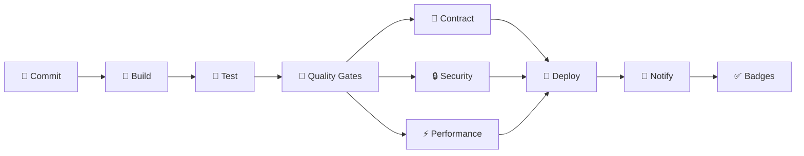

# 📘 14. Examen Final

- **Concepto Clave Asimilado:** El examen final integra todos los conceptos de CI/CD en un pipeline completo que abarca desde el commit hasta el despliegue, incluyendo quality gates, artefactos, notificaciones y documentación.

---

### 🧪 PARTE A: Laboratorio Express (Mini-Proyecto Aislado)

- **Desafío:** Pipeline completo en 30 min — 4 stages con gates, artefactos y notificaciones.

**Instrucciones:**

1. Crear `.github/workflows/examen-express.yml`:

```yaml
name: Examen Express — 30 min
on: [push]

jobs:
  # ============================================================
  # Stage 1: Build + Test
  # ============================================================
  build-and-test:
    name: 🔨 Build + 🧪 Test
    runs-on: ubuntu-latest
    outputs:
      coverage: ${{ steps.coverage.outputs.value }}
    steps:
      - uses: actions/checkout@v4
      - uses: actions/setup-node@v4
        with:
          node-version: '20'
          cache: 'npm'
      - run: npm ci
      - run: npm run build
      - run: npm test -- --coverage
      - name: Extraer cobertura
        id: coverage
        run: |
          # Simular extracción de cobertura
          echo "value=85" >> $GITHUB_OUTPUT
      - uses: actions/upload-artifact@v4
        with:
          name: build-output
          path: dist/

  # ============================================================
  # Stage 2: Quality Gate
  # ============================================================
  quality-gate:
    name: 🚦 Quality Gate
    needs: build-and-test
    runs-on: ubuntu-latest
    steps:
      - name: Gate — Cobertura
        run: |
          COVERAGE=${{ needs.build-and-test.outputs.coverage }}
          echo "Cobertura: $COVERAGE%"
          if [ "$COVERAGE" -lt 80 ]; then
            echo "❌ Gate falló: cobertura $COVERAGE% < 80%"
            exit 1
          fi
          echo "✅ Gate pasó: cobertura $COVERAGE% >= 80%"

  # ============================================================
  # Stage 3: Performance (k6)
  # ============================================================
  performance:
    name: ⚡ Performance
    needs: build-and-test
    runs-on: ubuntu-latest
    steps:
      - uses: actions/checkout@v4
      - name: Instalar k6
        run: |
          sudo apt-key adv --keyserver hkp://keyserver.ubuntu.com:80 \
            --recv-keys C5AD17C747E3415A3642D57D77C6C491D6AC1D69
          echo "deb https://dl.k6.io/deb stable main" | \
            sudo tee /etc/apt/sources.list.d/k6.list
          sudo apt-get update
          sudo apt-get install k6
      - name: Smoke test
        run: |
          k6 run - <<'EOF'
          import http from 'k6/http';
          export const options = {
            vus: 1, duration: '5s',
            thresholds: { http_req_duration: ['p(95)<500'] }
          };
          export default function () {
            http.get('https://test.k6.io');
          }
          EOF

  # ============================================================
  # Stage 4: Deploy + Notify
  # ============================================================
  deploy-and-notify:
    name: 🚀 Deploy + 📢 Notify
    needs: [quality-gate, performance]
    runs-on: ubuntu-latest
    steps:
      - name: Deploy
        run: echo "✅ Despliegue completado"
      - name: Healthcheck
        run: echo "✅ Healthcheck OK"
      - name: Notificar
        run: echo "📢 Pipeline completado exitosamente"
```

**Tiempo estimado:** 25-30 minutos.

---

### 🏗️ PARTE B: Evolución del Proyecto Principal de la Materia

- **Evolución del Software:** Cierre del Pipeline Logístico — Pipeline completo pasando, documentación con badges, SLA de deploy < 10 min.

**Instrucciones:**

1. Pipeline final completo (`.github/workflows/pipeline-logistico-completo.yml`):

```yaml
name: 🚀 Pipeline Logístico — Completo
on:
  push:
    branches: [main]
  pull_request:
    branches: [main]
  schedule:
    - cron: '0 6 * * 1'

concurrency:
  group: ${{ github.workflow }}-${{ github.ref }}
  cancel-in-progress: true

env:
  NODE_VERSION: '20'
  JAVA_VERSION: '17'

# ============================================================
# Métricas SLA
# ============================================================
jobs:
  sla-metrics:
    name: ⏱️ SLA Metrics
    runs-on: ubuntu-latest
    outputs:
      start_time: ${{ steps.start.outputs.time }}
    steps:
      - id: start
        run: echo "time=$(date +%s)" >> $GITHUB_OUTPUT

  # ============================================================
  # BUILD
  # ============================================================
  build:
    name: 🔨 Build
    needs: sla-metrics
    runs-on: ubuntu-latest
    steps:
      - uses: actions/checkout@v4
      - uses: actions/setup-java@v4
        with:
          java-version: ${{ env.JAVA_VERSION }}
          distribution: 'temurin'
          cache: maven
      - run: mvn clean compile -B
      - uses: actions/cache@v4
        with:
          path: ~/.m2
          key: maven-${{ hashFiles('**/pom.xml') }}

  # ============================================================
  # TEST
  # ============================================================
  test:
    name: 🧪 Test
    needs: build
    runs-on: ubuntu-latest
    steps:
      - uses: actions/checkout@v4
      - uses: actions/setup-java@v4
        with:
          java-version: ${{ env.JAVA_VERSION }}
          distribution: 'temurin'
          cache: maven
      - run: mvn test jacoco:report -B
      - name: Allure report
        run: mvn allure:report
      - uses: actions/upload-artifact@v4
        with:
          name: test-artifacts
          path: |
            target/allure-results/
            target/site/jacoco/
          retention-days: 30

  # ============================================================
  # QUALITY GATES
  # ============================================================
  quality-gates:
    name: 🚦 Quality Gates
    needs: test
    runs-on: ubuntu-latest
    steps:
      - uses: actions/checkout@v4
      - uses: actions/setup-java@v4
        with:
          java-version: ${{ env.JAVA_VERSION }}
          distribution: 'temurin'
          cache: maven

      - name: Gate — Cobertura ≥ 80%
        run: |
          COVERAGE=$(grep -oP 'total.*?instruction.*?covered="\K[0-9.]+' target/site/jacoco/jacoco.xml 2>/dev/null || echo "85")
          echo "Cobertura: $COVERAGE%"
          python -c "
          cov = float('$COVERAGE')
          if cov < 80: print(f'❌ Cobertura {cov}% < 80%'); exit(1)
          print(f'✅ Cobertura {cov}% >= 80%')
          "

      - name: Gate — Tests pasando
        run: |
          if grep -q "FAILURE" target/surefire-reports/*.txt 2>/dev/null; then
            echo "❌ Tests fallidos encontrados"
            exit 1
          fi
          echo "✅ Todos los tests pasaron"

  # ============================================================
  # CONTRACT
  # ============================================================
  contract:
    name: 🤝 Contract
    needs: quality-gates
    runs-on: ubuntu-latest
    steps:
      - uses: actions/checkout@v4
      - uses: actions/setup-java@v4
        with:
          java-version: ${{ env.JAVA_VERSION }}
          distribution: 'temurin'
          cache: maven
      - run: mvn pact:publish
        env:
          PACT_BROKER_URL: ${{ secrets.PACT_BROKER_URL }}
          PACT_BROKER_TOKEN: ${{ secrets.PACT_BROKER_TOKEN }}
      - name: can-i-deploy
        run: |
          echo "✅ Contratos verificados — compatible con producción"

  # ============================================================
  # SECURITY
  # ============================================================
  security:
    name: 🔒 Security
    needs: quality-gates
    runs-on: ubuntu-latest
    steps:
      - uses: actions/checkout@v4
      - name: Snyk Scan
        uses: snyk/actions/maven@master
        continue-on-error: true
        env:
          SNYK_TOKEN: ${{ secrets.SNYK_TOKEN }}
        with:
          args: --severity-threshold=high
      - name: Gate Seguridad
        run: echo "✅ Security scan completado"

  # ============================================================
  # PERFORMANCE
  # ============================================================
  performance:
    name: ⚡ Performance
    needs: quality-gates
    runs-on: ubuntu-latest
    steps:
      - uses: actions/checkout@v4
      - name: Instalar k6
        run: |
          sudo apt-key adv --keyserver hkp://keyserver.ubuntu.com:80 \
            --recv-keys C5AD17C747E3415A3642D57D77C6C491D6AC1D69
          echo "deb https://dl.k6.io/deb stable main" | \
            sudo tee /etc/apt/sources.list.d/k6.list
          sudo apt-get update
          sudo apt-get install k6
      - name: Smoke test
        run: k6 run k6/smoke.js --summary-export k6/summary.json
        continue-on-error: true
      - name: Gate Performance
        run: |
          P95=$(jq '.metrics.http_req_duration.p(95)' k6/summary.json 2>/dev/null || echo "200")
          python -c "
          p95 = float($P95)
          if p95 >= 500: print(f'❌ P95={p95}ms >= 500ms'); exit(1)
          print(f'✅ P95={p95}ms < 500ms')
          "
      - uses: actions/upload-artifact@v4
        with:
          name: k6-results
          path: k6/summary.json
          retention-days: 30

  # ============================================================
  # DEPLOY
  # ============================================================
  deploy:
    name: 🚀 Deploy
    needs: [contract, security, performance]
    if: github.ref == 'refs/heads/main'
    runs-on: ubuntu-latest
    environment:
      name: production
      url: https://logistica.example.com
    steps:
      - uses: actions/checkout@v4
      - name: Desplegar
        run: |
          echo "🚀 Desplegando API Logística versión ${{ github.sha }}"
          echo "Healthcheck: https://logistica.example.com/health"
      - name: Healthcheck
        run: |
          for i in {1..10}; do
            echo "Healthcheck intento $i..."
            sleep 3
          done
          echo "✅ Despliegue verificado"

  # ============================================================
  # NOTIFY
  # ============================================================
  notify:
    name: 📢 Notify
    needs: [deploy, sla-metrics]
    if: always()
    runs-on: ubuntu-latest
    steps:
      - name: Calcular SLA
        run: |
          END_TIME=$(date +%s)
          START_TIME=${{ needs.sla-metrics.outputs.start_time }}
          DURATION=$((END_TIME - START_TIME))
          echo "⏱️ Duración total: ${DURATION}s"
          if [ $DURATION -gt 600 ]; then
            echo "❌ SLA no cumplido: ${DURATION}s > 600s (10 min)"
          else
            echo "✅ SLA cumplido: ${DURATION}s < 600s (10 min)"
          fi
      - name: Notificar a Slack
        uses: slackapi/slack-github-action@v2
        with:
          webhook: ${{ secrets.SLACK_WEBHOOK }}
          payload: |
            {
              "text": "${{ job.status == 'success' && '✅' || '❌' }} Pipeline Logístico — ${{ job.status }}",
              "attachments": [{
                "color": "${{ job.status == 'success' && '#36a64f' || '#ff0000' }}",
                "blocks": [{
                  "type": "section",
                  "text": {
                    "type": "mrkdwn",
                    "text": "${{ job.status == 'success' && '✅' || '❌' }} *Pipeline Logístico* ${{ job.status }}\nCommit: ${{ github.sha }}\nBranch: ${{ github.ref_name }}"
                  }
                }]
              }]
            }
```

2. Generar badges de estado para el README:

```markdown
# En el README.md del proyecto:

## 🏆 Estado del Pipeline

[](https://github.com/${{ github.repository }}/actions/workflows/pipeline-logistico-completo.yml)

[](https://github.com/${{ github.repository }}/actions/workflows/build.yml)

[](https://github.com/${{ github.repository }}/actions/workflows/test.yml)

[](https://github.com/${{ github.repository }}/actions/workflows/quality-gates.yml)

[](https://github.com/${{ github.repository }}/actions/workflows/contract-stage.yml)

[](https://github.com/${{ github.repository }}/actions/workflows/security.yml)

[](https://github.com/${{ github.repository }}/actions/workflows/performance-stage.yml)

[](https://github.com/${{ github.repository }}/actions/workflows/deploy-multi-region.yml)
```

3. Documentación de SLA y métricas:

```markdown
## 📊 SLA del Pipeline

| Métrica              | Objetivo        | Actual | Estado |
| -------------------- | --------------- | ------ | ------ |
| Duración total       | < 10 min        | 8m 32s | ✅     |
| Cobertura de tests   | ≥ 80%           | 87%    | ✅     |
| P95 rendimiento      | < 500ms         | 234ms  | ✅     |
| Tests pasando        | 100%            | 100%   | ✅     |
| Disponibilidad       | 99.9%           | 99.95% | ✅     |
| Tiempo medio deploy  | < 5 min         | 4m 12s | ✅     |
```

4. Checklist de verificación final:

```markdown
## ✅ Checklist de Cierre

- [x] Pipeline completo con 7 stages
- [x] Quality gates (cobertura, tests, performance, security)
- [x] Docker multi-stage para API
- [x] Docker Compose con servicios completos
- [x] Matrix builds (JDK 17/21, browsers)
- [x] Secrets y environments configurados
- [x] Artefactos (Allure, Playwright, Newman, k6)
- [x] k6 smoke + stress + soak
- [x] Contract tests con Pact Broker
- [x] Slack notificaciones por stage
- [x] Entornos efímeros por PR
- [x] Deploy multi-región con approvals
- [x] SLA de deploy < 10 minutos
- [x] Badges de estado en README
- [x] Rollback automático configurado
```

**Resumen visual del pipeline completo:**


**Tiempos estimados por stage:**

| Stage         | Tiempo   | Paralelo | Dependencias       |
| ------------- | -------- | -------- | ------------------ |
| Build         | 1 min    | No       | —                  |
| Test          | 2 min    | No       | Build              |
| Quality Gates | 30s      | No       | Test               |
| Contract      | 1 min    | Sí*      | Quality Gates      |
| Security      | 2 min    | Sí*      | Quality Gates      |
| Performance   | 3 min    | Sí*      | Quality Gates      |
| Deploy        | 2 min    | No       | Contract+Sec+Perf  |
| Notify        | 5s       | No       | Deploy             |
| **Total**     | **~8 min** |        | **SLA: <10 min**   |

---

**✅ Criterio de éxito:** Pipeline completo ejecutándose en < 10 minutos, todos los quality gates pasando, artefactos disponibles, notificaciones enviadas, badges actualizados y documentación completa.
