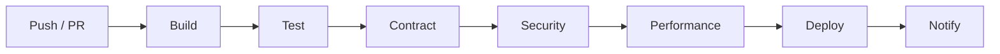

# 🚀 Pipeline de Despliegue Continuo Automatizado en GitHub Actions

**Proyecto Unificado de la Materia CI/CD**

## Objetivo

Construir un pipeline de CI/CD completo y profesional sobre GitHub Actions que automatice la integración, pruebas, verificación de contratos, análisis de rendimiento, despliegue multi-entorno y notificaciones para una **API de Logística**.

## Stack Tecnológico

| Herramienta     | Uso                                    |
| --------------- | -------------------------------------- |
| GitHub Actions  | Orquestación del pipeline              |
| Node.js / Java  | Runtime de la aplicación               |
| Docker          | Contenedores para la API y servicios   |
| Docker Compose  | Entorno de tests de integración        |
| Maven / Gradle  | Build de la API Java                   |
| JUnit / Jest    | Tests unitarios                         |
| Playwright      | Tests E2E                              |
| Newman          | Tests de API (Postman)                 |
| k6              | Tests de rendimiento                   |
| Pact            | Tests de contratos                     |
| Allure          | Reportes de tests                      |
| Slack           | Notificaciones                         |
| MySQL / Redis   | Servicios de infraestructura           |
| WireMock        | Mock de servicios externos             |

## Arquitectura del Pipeline

## Capítulos

| #  | Capítulo                                | Lab Express                 | Proyecto Principal                    |
| -- | --------------------------------------- | --------------------------- | ------------------------------------- |
| 01 | Pipelines y Stages                      | Pipeline Hola Mundo         | Stages del Pipeline Logístico         |
| 02 | GitHub Actions Basics                   | Hello World Workflow        | Pipeline Base de Integración          |
| 03 | Quality Gates                           | Gate Simulado               | Gates del Pipeline Logístico          |
| 04 | Docker Fundamentals                     | Docker Hello World          | Dockerfile para API de Logística      |
| 05 | Docker Compose Tests                    | Docker Compose Mínimo       | Compose de Logística                  |
| 06 | Matrix Builds                           | Matrix Hola Mundo           | Matrix Logístico                      |
| 07 | Environments y Secrets                  | Secrets Demo                | Secrets del Pipeline                  |
| 08 | Allure y Artefactos                     | Allure Artefacto            | Artefactos Completos                  |
| 09 | k6 y Performance Gates                  | k6 en GHA                   | Performance Stage                     |
| 10 | Pact y Contract Tests en CI             | Pact en CI                  | Contract Stage                        |
| 11 | Slack Notifications                     | Slack Hello                 | Notificaciones del Pipeline           |
| 12 | Ephemeral Environments                  | Review App                  | Ephemeral Logístico                   |
| 13 | Multi-Org Deployment                    | Deploy Multi-Env            | Deploy Logístico Multi-Región         |
| 14 | Examen Final                            | Pipeline en 30 min          | Cierre del Pipeline                   |

## Entregables Finales

- Pipeline completo funcionando en GitHub Actions
- Dockerfile multi-stage para la API
- Docker Compose con todos los servicios
- Scripts de k6 para rendimiento
- Contratos Pact publicados y verificados
- Notificaciones vía Slack
- Entornos efímeros por PR
- Despliegue multi-región con approvals
- Documentación con badges de estado

## Requisitos

- Cuenta de GitHub
- Repositorio con GitHub Actions habilitado
- Docker Desktop (local)
- Node.js 18+ / JDK 17+
- Cuenta de Slack (opcional para notificaciones)
- Pact Broker (local o SaaS)
