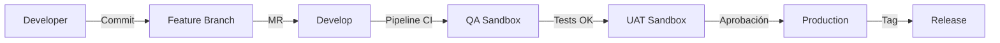

# 📘 14. Copado Basics

- **Concepto Clave Asimilado:** Fundamentos de Copado como plataforma de CI/CD para Salesforce. Pipelines, ramas por ambiente, datasets de prueba, validación pre-deploy y estrategias de rollback.

---

### 🧪 PARTE A: Laboratorio Express (Mini-Proyecto Aislado)

- **Desafío:** Copado Fundamentals — Documentar conceptos clave: pipelines, commits, deployments, change sets vs Copado

**Instrucciones:**

1. Crea un documento de referencia `COPADO-CONCEPTOS.md` (o integra en este capítulo):

**Conceptos Fundamentales de Copado**

#### 1. Pipelines
Un pipeline en Copado define el flujo de despliegue desde el entorno de desarrollo hasta producción. Cada etapa del pipeline ejecuta acciones automatizadas: validación, pruebas, despliegue, notificaciones.

```
[Developer Sandbox] → [CI Job] → [QA Sandbox] → [UAT Sandbox] → [Production]
```

#### 2. Commits y Ramas
Copado se integra con Git. Cada feature se desarrolla en una rama y se fusiona mediante merge requests/pull requests.

| Rama | Propósito |
|------|-----------|
| `main` | Código listo para producción |
| `develop` | Integración de features |
| `feature/xxx` | Desarrollo de funcionalidades |
| `release/x.x` | Preparación de release |
| `hotfix/xxx` | Correcciones urgentes |

#### 3. Change Sets vs Copado

| Aspecto | Change Sets | Copado |
|---------|-------------|--------|
| **Control de versiones** | Manual, no hay historial | Git-based, trazabilidad completa |
| **Automatización** | Manual (upload + download + deploy) | Pipelines automatizados |
| **Pruebas** | No integra tests | Ejecuta tests automáticamente |
| **Rollback** | No soportado | Deploy inverso con revert |
| **Colaboración** | Limitada | Pull requests, code review |
| **Visibilidad** | Setup → Change Sets | Dashboard web con métricas |
| **Errores comunes** | Componentes faltantes, dependencias rotas | Validación pre-deploy automática |

#### 4. Componentes de Copado

- **User Story**: Unidad de trabajo asociada a una rama Git
- **Pipeline**: Secuencia de etapas de despliegue
- **Job**: Ejecución individual dentro de un pipeline
- **Artifact**: Paquete de metadatos listo para deploy
- **Deployment**: Instancia específica de un despliegue
- **Test Set**: Conjunto de pruebas a ejecutar
- **Data Set**: Datos de prueba para validación post-deploy
- **Result**: Resultado de la ejecución (passed, failed, warning)

#### 5. Flujo Típico en Copado



#### 6. Buenas Prácticas

- Una User Story por funcionalidad atómica
 - Commits frecuentes y descriptivos
 - Tests incluidos en la misma User Story
 - Validación pre-deploy siempre activada
 - Rollback plan documentado antes de cada deploy a producción
 - Notificaciones a Slack/Teams en cada etapa del pipeline
 - Data sets para verificar datos post-deploy

2. Crea el archivo `copado-config-template.json` como plantilla de configuración:
```json
{
  "pipeline": {
    "name": "ERP Clientes - Pipeline Completo",
    "description": "Pipeline de principio a fin para el sistema ERP",
    "stages": [
      {
        "name": "CI Validation",
        "type": "ciJob",
        "actions": ["validateDeployment", "runApexTests", "runLwcJest"]
      },
      {
        "name": "Deploy to QA",
        "type": "deployment",
        "targetOrg": "QA_Sandbox",
        "actions": ["deployMetadata", "runTests", "updateDataSets"]
      },
      {
        "name": "Deploy to UAT",
        "type": "deployment",
        "targetOrg": "UAT_Sandbox",
        "actions": ["deployMetadata", "runTests", "notifyTesters"]
      },
      {
        "name": "Deploy to Production",
        "type": "deployment",
        "targetOrg": "Production",
        "actions": ["preValidate", "backupMetadata", "deployMetadata", "runTests", "notify"]
      }
    ],
    "notifications": {
      "slack": {
        "channel": "#erp-deployments",
        "events": ["pipeline.start", "stage.start", "stage.complete", "pipeline.complete", "pipeline.failed"]
      },
      "email": {
        "recipients": ["admin@empresa.com", "tl@empresa.com"],
        "events": ["pipeline.failed"]
      }
    }
  }
}
```

---

### 🏗️ PARTE B: Evolución del Proyecto Principal de la Materia

- **Evolución del Software:** Estrategia de Deploy con Copado — Plan de implementación completo: ramas por ambiente, datasets de prueba, validación pre-deploy y rollback plan

**Instrucciones:**

1. Crea el documento `erp-copado-strategy.md`:

# Estrategia de Deploy ERP con Copado

## 1. Estructura de Ramas

```
main
├── develop
│   ├── feature/erp-modelo-datos          # Modelo de datos Cliente, Contrato, Comision
│   ├── feature/erp-cliente-service        # Servicio de clientes
│   ├── feature/erp-contrato-service       # Servicio de contratos
│   ├── feature/erp-sync-bancaria          # Sincronización con core bancario
│   ├── feature/erp-comisiones             # Cálculo de comisiones
│   ├── feature/erp-batch-renovacion       # Batch de renovación de contratos
│   ├── feature/erp-platform-events        # Platform Events
│   ├── feature/erp-flow-credito           # Flow de aprobación de crédito
│   └── feature/erp-lwc-contract-list      # Componente LWC de lista de contratos
├── release/v1.0.0
├── release/v1.1.0
└── hotfix/xxx
```

## 2. Pipelines por Ambiente

### Pipeline: Dev → QA
```yaml
Etapas:
  1. CI Job:
     - Validar metadatos XML
     - Ejecutar tests Apex (RunLocalTests)
     - Ejecutar tests LWC Jest
     - Gate: cobertura > 75%

  2. Deploy a QA:
     - Desplegar metadatos a QA Sandbox
     - Ejecutar tests Apex (RunLocalTests)
     - Actualizar datasets de prueba
     - Notificar a Slack #erp-qa

  3. Pruebas Automatizadas:
     - Ejecutar test suite de regresión
     - Verificar resultados de datasets
     - Generar reporte de calidad
```

### Pipeline: QA → UAT
```yaml
Etapas:
  1. Validación Pre-Deploy:
     - Check-only deploy a UAT
     - Verificar dependencias

  2. Deploy a UAT:
     - Desplegar metadatos
     - Ejecutar tests selectos
     - Notificar a testers UAT

  3. Pruebas Manuales:
     - Testers ejecutan casos de prueba
     - Aprobación de User Story
```

### Pipeline: UAT → Producción
```yaml
Etapas:
  1. Pre-Validación:
     - Check-only deploy a producción
     - Backup de metadatos actuales
     - Verificar tests selectos

  2. Deploy a Producción:
     - Desplegar metadatos (con autorización)
     - Ejecutar tests selectos
     - Verificar integridad de datos

  3. Post-Deploy:
     - Validar datasets en producción
     - Notificar a stakeholders
     - Crear tag de release
```

## 3. Datasets de Prueba

### QA Dataset
```json
{
  "name": "erp-qa-data-v1",
  "records": {
    "Cliente__c": [
      { "Name": "Cliente QA 1", "RFC__c": "QATEST123456XYZ", "Ingresos_Anuales__c": 5000000, "Categoria__c": "Silver" },
      { "Name": "Cliente QA 2", "RFC__c": "QATEST789012XYZ", "Ingresos_Anuales__c": 10000000, "Categoria__c": "Gold" },
      { "Name": "Cliente QA 3", "RFC__c": "QATEST345678XYZ", "Ingresos_Anuales__c": 500000, "Categoria__c": "Bronze" }
    ],
    "Contrato__c": [
      { "Name": "CTR-QA-001", "Estado__c": "Activo", "Monto__c": 150000, "Fecha_Inicio__c": "2025-01-01", "Fecha_Expiracion__c": "2026-01-01" },
      { "Name": "CTR-QA-002", "Estado__c": "En_Renovacion", "Monto__c": 250000, "Fecha_Inicio__c": "2024-06-01", "Fecha_Expiracion__c": "2025-07-01" }
    ]
  }
}
```

### UAT Dataset
```json
{
  "name": "erp-uat-data-v1",
  "records": {
    "Cliente__c": [
      { "Name": "Corporativo ABC", "RFC__c": "ABC123456XYZ", "Ingresos_Anuales__c": 50000000, "Categoria__c": "Platinum" },
      { "Name": "Empresa XYZ", "RFC__c": "XYZ789012XYZ", "Ingresos_Anuales__c": 8000000, "Categoria__c": "Gold" },
      { "Name": "Comercial LMN", "RFC__c": "LMN345678XYZ", "Ingresos_Anuales__c": 1500000, "Categoria__c": "Silver" }
    ],
    "Contrato__c": [
      { "Name": "CTR-UAT-001", "Estado__c": "Activo", "Monto__c": 500000 },
      { "Name": "CTR-UAT-002", "Estado__c": "Activo", "Monto__c": 1200000 },
      { "Name": "CTR-UAT-003", "Estado__c": "Vencido", "Monto__c": 75000 }
    ]
  }
}
```

## 4. Validación Pre-Deploy

### Lista de Verificación Pre-Producción
```
[ ] Todos los tests Apex pasan (cobertura > 75%)
[ ] Todos los tests Jest pasan
[ ] Code review aprobado (mínimo 2 approves)
[ ] Check-only deploy exitoso en producción
[ ] Backup de metadatos actuales completado
[ ] Dataset de producción verificado
[ ] Rollback plan documentado
[ ] Ventana de deploy confirmada
[ ] Stakeholders notificados
[ ] Feature flags desactivadas si es necesario
```

### Script de Validación Pre-Deploy (Apex)
```apex
public class PreDeployValidator {

    public static Boolean validarPreDeploy() {
        System.debug('=== VALIDACIÓN PRE-DEPLOY ===');

        // 1. Verificar cobertura de tests
        Boolean coberturaOk = verificarCobertura();
        System.debug('Cobertura > 75%: ' + coberturaOk);

        // 2. Verificar que no hay test fallidos
        Boolean testsOk = verificarTestsRecientes();
        System.debug('Tests sin fallos: ' + testsOk);

        // 3. Verificar dependencias de objetos
        Boolean dependenciasOk = verificarDependencias();
        System.debug('Dependencias OK: ' + dependenciasOk);

        // 4. Verificar permisos de campos nuevos
        Boolean permisosOk = verificarPermisos();
        System.debug('Permisos OK: ' + permisosOk);

        Boolean resultado = coberturaOk && testsOk && dependenciasOk && permisosOk;
        System.debug('Resultado validación: ' + (resultado ? 'APROBADO' : 'RECHAZADO'));

        return resultado;
    }

    private static Boolean verificarCobertura() {
        // En un entorno real, consultar Tooling API para cobertura
        return true; // Placeholder
    }

    private static Boolean verificarTestsRecientes() {
        return true; // Placeholder
    }

    private static Boolean verificarDependencias() {
        // Verificar que todos los campos referenciados existen
        try {
            Schema.DescribeSObjectResult clienteDescribe = Cliente__c.SObjectType.getDescribe();
            Schema.DescribeSObjectResult contratoDescribe = Contrato__c.SObjectType.getDescribe();
            Schema.DescribeSObjectResult comisionDescribe = Comision__c.SObjectType.getDescribe();

            Map<String, Schema.SObjectField> clienteFields = clienteDescribe.fields.getMap();
            Map<String, Schema.SObjectField> contratoFields = contratoDescribe.fields.getMap();
            Map<String, Schema.SObjectField> comisionFields = comisionDescribe.fields.getMap();

            String[] camposRequeridosCliente = new String[]{
                'Name', 'RFC__c', 'Ingresos_Anuales__c', 'Categoria__c',
                'Limite_de_Credito__c', 'Sincronizado__c'
            };
            String[] camposRequeridosContrato = new String[]{
                'Name', 'Monto__c', 'Estado__c', 'Fecha_Inicio__c',
                'Fecha_Expiracion__c', 'Cliente__c', 'Vendedor__c'
            };
            String[] camposRequeridosComision = new String[]{
                'Name', 'Monto_Comision__c', 'Porcentaje__c', 'Estado__c', 'Contrato__c'
            };

            for (String campo : camposRequeridosCliente) {
                if (!clienteFields.containsKey(campo)) {
                    System.debug('ERROR: Campo faltante en Cliente__c: ' + campo);
                    return false;
                }
            }
            for (String campo : camposRequeridosContrato) {
                if (!contratoFields.containsKey(campo)) {
                    System.debug('ERROR: Campo faltante en Contrato__c: ' + campo);
                    return false;
                }
            }
            for (String campo : camposRequeridosComision) {
                if (!comisionFields.containsKey(campo)) {
                    System.debug('ERROR: Campo faltante en Comision__c: ' + campo);
                    return false;
                }
            }

            return true;
        } catch (Exception e) {
            System.debug('ERROR validando dependencias: ' + e.getMessage());
            return false;
        }
    }

    private static Boolean verificarPermisos() {
        return true; // Placeholder
    }
}
```

## 5. Plan de Rollback

### Escenarios de Rollback

| Escenario | Acción | Tiempo Estimado |
|-----------|--------|----------------|
| Test falla en QA | Corregir código, re-deploy | 1-4 horas |
| Deploy a UAT falla | Revisar conflictos de metadatos | 2-8 horas |
| Deploy a producción falla | Restaurar desde backup | 30-60 minutos |
| Error funcional en producción | Revertir a release anterior | 1-2 horas |
| Regresión de datos | Restaurar datos desde backup | 2-4 horas |

### Procedimiento de Rollback

```yaml
rollback-production:
  steps:
    1. Notificar a stakeholders sobre el rollback
    2. Identificar el tag del release anterior
    3. Ejecutar deploy inverso:
       sf project deploy start \
         --source-dir force-app/main/default \
         --target-org Production \
         --wait 30

    4. Restaurar datos si es necesario:
       - Ejecutar script de restauración de datos
       - Verificar integridad de registros críticos

    5. Ejecutar smoke tests en producción:
       - Verificar login de usuarios
       - Verificar creación de Contrato
       - Verificar cálculo de comisiones

    6. Notificar a stakeholders sobre la finalización
    7. Documentar incidente y causa raíz
```

### Comandos de Rollback con SF CLI

```bash
# 1. Backup de metadatos actuales antes del deploy
sf project retrieve start \
  --source-dir force-app/main/default \
  --target-org Production \
  --output-dir ./backup/pre-deploy-$(date +%Y%m%d)

# 2. Si el deploy falla, restaurar desde backup
sf project deploy start \
  --source-dir ./backup/pre-deploy-$(date +%Y%m%d) \
  --target-org Production \
  --wait 30

# 3. Verificar estado post-rollback
sf apex run test \
  --target-org Production \
  --test-level RunSpecifiedTests \
  --class-names "ClienteServiceTest,ContratoServiceTest"
```

## 6. Configuración de Copado para ERP

### User Story Template
```json
{
  "userStory": {
    "title": "[ERP] Feature: {nombre}",
    "description": "### Descripción\n{descripción}\n\n### Criterios de Aceptación\n- [ ] Criterio 1\n- [ ] Criterio 2\n- [ ] Tests pasan con cobertura > 75%\n\n### Tareas Técnicas\n- [ ] Desarrollo en rama feature/{nombre}\n- [ ] Tests unitarios\n- [ ] Code review\n- [ ] Deploy a QA\n- [ ] Validación en QA",
    "labels": ["erp", "salesforce", "apex"],
    "assignedTo": "{developer}",
    "pipeline": "ERP Pipeline Completo"
  }
}
```

### Pipeline Configuration en Copado
```yaml
pipeline:
  name: "ERP Pipeline Completo"
  
  stages:
    - name: "CI Build"
      type: "ciJob"
      config:
        script: |
          sf project deploy start --source-dir force-app/main/default --target-org QASandbox --wait 20
          sf apex run test --target-org QASandbox --test-level RunLocalTests --wait 15

    - name: "Deploy to QA"
      type: "deployment"
      config:
        targetOrg: "QA_Sandbox"
        postDeployScript: |
          // Actualizar datasets
          sf data create record --sobject Cliente__c --values "Name=Cliente QA"

    - name: "Deploy to UAT"
      type: "deployment"
      config:
        targetOrg: "UAT_Sandbox"
        requiredApprovals: 2
        approvalGroup: "UAT Testers"

    - name: "Deploy to Production"
      type: "deployment"
      config:
        targetOrg: "Production"
        requiredApprovals: 3
        approvalGroup: "Release Managers"
        preDeployScript: "scripts/pre-validate.sh"
        postDeployScript: "scripts/post-deploy-verify.sh"
        rollbackScript: "scripts/rollback.sh"
        backupBeforeDeploy: true
```

## 7. Monitoreo y Alertas

### Eventos a Monitorear en Copado
- Pipeline iniciado / completado / fallido
- Tests fallidos por primera vez
- Cobertura por debajo del umbral
- Deploy a producción exitoso / fallido
- Rollback ejecutado

### Dashboard de Métricas
```
Pipeline ERP - Últimos 30 días
├── Deploys exitosos: 15
├── Deploys fallidos: 2
├── Rollbacks: 1
├── Tiempo promedio de deploy: 12 min
├── Cobertura promedio: 82%
└── Tests totales ejecutados: 1,250
```
